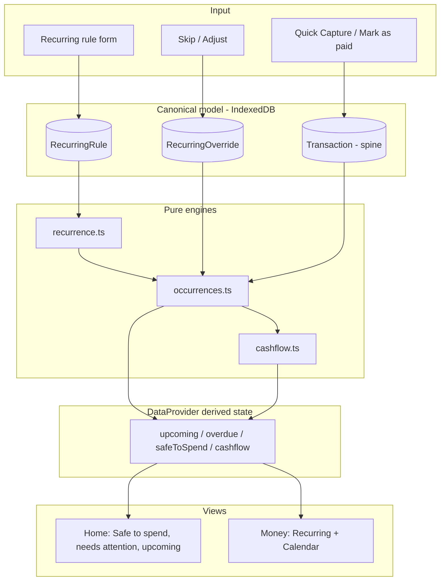
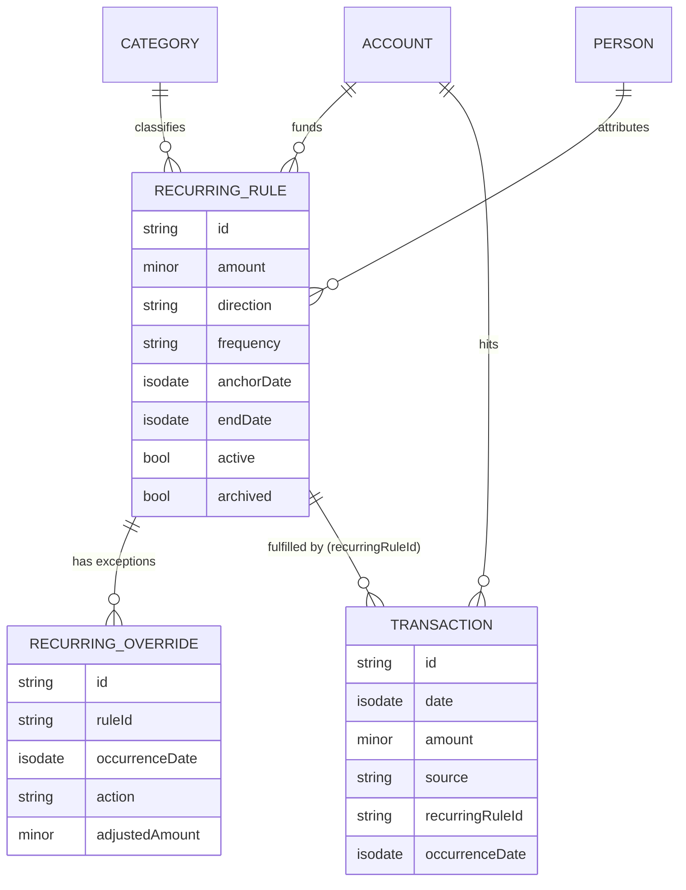
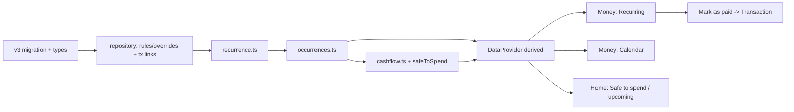
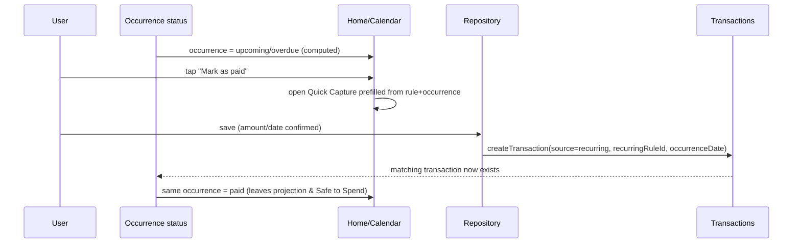
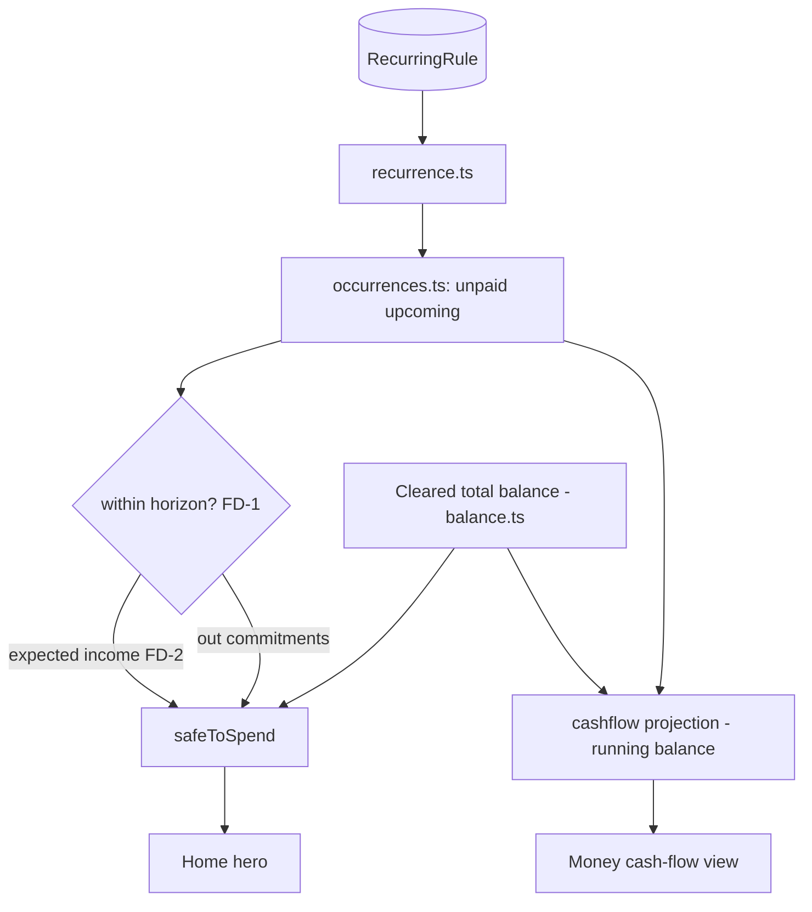

# Phase 2 — Architecture & Implementation Blueprint

**ALL-IN-ONE PERSONAL FINANCE by PremierWork**
Authoritative reference for Phase 2 (Recurring & Cash Flow). Implementation-ready.
As of 2026-09-17. Status: **APPROVED FOR IMPLEMENTATION PLANNING — do not code until this is signed off.**

This document is derived from, in priority order: (1) the existing repository (source of truth for
what exists), (2) the Final Product Blueprint, (3) the Phase 0 + Phase 1 Build Specification, (4) the
28-workflow spreadsheet research and its verified formulas, (5) the visual/theme reference. It does
not restate those documents; it extends them into Phase 2.

---

## 1. Executive summary

Phase 1 shipped the financial spine: a local-first (IndexedDB/Dexie) app where **Transactions** are
the single source of truth, with pure engines for balances and aggregation, a repository layer, a
migration runner (`SCHEMA_VERSION = 2`), and screens for Setup, Home, Money and management. All 26
tests pass; typecheck and the buyer-language check are clean.

Phase 2 adds the **planning / cash-flow layer** on top of that spine without creating a second
ledger. It introduces exactly one new stored concept — a **Recurring Rule** (a repeating bill or
income *definition*) — and one small, optional exception table. Everything else Phase 2 shows
(upcoming bills, a calendar, overdue items, cash-flow projection, Safe to Spend) is **derived** at
read time by pure engines from two inputs: the recurring rules (future expectations) and the actual
transactions (what really happened).

The core principle, inherited and enforced: **a recurring rule describes what is expected to happen;
a transaction records what actually happened.** An occurrence becomes real money only when a
Transaction is created for it (`source: "recurring"`, linked back to the rule). Projected occurrences
that have not happened yet are never stored — they are recomputed on demand, exactly as the source
spreadsheets generated their payment schedules from definitions rather than storing 10,000 rows.

Phase 2 changes three existing surfaces (Home, Money, Quick Capture) and adds no new top-level
navigation. The recurrence date rules were already verified against the source cells during the
Blueprint phase and are restated here as the implementation spec.

---

## 2. Phase 2 scope

Phase 2 is the next dependency layer after the transaction/account foundation. It contains:

1. **Recurring rules** — user-defined repeating bills and income (a *definition*, entered once):
   name, amount, direction (out/in), category, account, person, frequency, start date, optional end
   date, active flag.
2. **Recurrence engine** — pure logic that expands a rule into dated occurrences using the verified
   frequency rules, and computes the next occurrence.
3. **Occurrence status** — derived join of projected occurrences against actual transactions to label
   each occurrence **upcoming**, **due/overdue**, **paid**, or **skipped**.
4. **Upcoming & overdue lists** — what is coming, what is late, surfaced on Home and Money.
5. **Calendar** — a month grid placing occurrences (and, optionally, actual transactions) on their
   dates, with per-day and per-week totals.
6. **Cash-flow projection** — a forward running-balance view: current balance plus projected income
   minus projected expenses over a horizon.
7. **Safe to Spend** — the headline habit number: what is safe to spend now given upcoming
   commitments. This is *new product logic* (not a spreadsheet formula); its exact window is a founder
   decision with a stated default.
8. **"Mark as paid" flow** — confirming an occurrence creates the actual Transaction, pre-filled from
   the rule, reusing the existing Quick Capture path.

**Budget foundations:** Phase 2 does **not** build budgeting. It only ensures the occurrence and
period model that Phase 3 budgeting will consume already exists. No budget entities are created here.

---

## 3. What is explicitly OUT of scope

Out of scope for Phase 2 (built in later phases; do not start early):

- **Monthly / paycheck budgets, budget-vs-actual, carry-over, zero-based, 50/30/20** — Phase 3.
- **Goals / sinking funds, debt payoff** — Phase 4. (The recurring engine is designed to be reusable
  by recurring contributions/payments later, but no goal/debt entity is created now.)
- **Net worth, investments, forecasts** — Phase 5.
- **Dashboard insights, spending patterns, the no-spend challenge, reminders/notifications delivery,
  annual reports** — Phase 6. (Phase 2 computes the *data* an alert would need — overdue, upcoming —
  but does not build a notification delivery system.)
- **Multi-user, sync, multi-currency UI** — deferred product-wide; schema stays ready.
- **Automatic posting of transactions without user confirmation** — see Founder Decision FD-3; default
  is manual confirmation, so auto-posting is out of scope unless the founder opts in.

Nothing in Phase 2 modifies Phase 0/1 behavior. The only schema change is additive (Section 7).

---

## 4. Research findings from the 28 spreadsheets

The 28 workflow tabs were analyzed in the Spreadsheet Intelligence Research Bible; this section pulls
only what bears on Phase 2. The relevant tabs are **RECURRING, PAYMENTS, CALENDAR, DASHBOARD** (its
upcoming/overdue and TODAY()-driven parts), and, as evidence of the period model, the monthly tabs
and **ANNUAL TOTALS**. The standalone planners (SINKING FUNDS, DEBT, NET WORTH, INVESTMENT, CHALLENGE)
are **not** Phase 2.

What the research establishes for Phase 2:

- **RECURRING is a definitions table, not a ledger.** Each row is one repeating item: sub-category,
  frequency, amount, a single **"1st payment"** anchor date, an optional **end date**, account, and
  earner (person). There is **no second-payment field** (an earlier assumption, corrected during
  verification).
- **The frequency set is fixed and small.** From `RECURRING` cols AP25:AR33: *One time, Every Week
  (+7 days), Every 2 Weeks (+14), Every 4 Weeks (+28), Every Month, Every 2 Months, Every Quarter,
  Every 6 Months, Every Year.* Week-based frequencies add fixed days; month-based frequencies step
  by whole months. (The sheet's PAYMENTS also showed per-year counts of 52/26/13, but that was its
  fixed row budget — a spreadsheet-mechanics artifact — not a product rule; see the note in §8.1.)
- **PAYMENTS is a derived schedule, not source data.** It expands each RECURRING definition into
  individual dated occurrences (~10,800 pre-provisioned rows, mostly empty). This is presentation/
  spreadsheet-mechanics — in software it becomes an on-demand computed list, never a stored table.
- **CALENDAR is a read-only projection** of PAYMENTS onto a month grid with weekly totals and a today
  marker (SUMIFS against PAYMENTS by date). Presentation-only logic; the placement is the value.
- **DASHBOARD's upcoming/overdue** is driven by `TODAY()` comparisons against the payment schedule.
  This is the evidence for the upcoming/overdue/"what needs attention" concept.
- **The period model** (start date → 12-month window via EOMONTH; month boundaries) recurs across
  ANNUAL TOTALS, CALENDAR and the monthly tabs. Phase 1 already implements month boundaries
  (`lib/period.ts`); Phase 2 reuses it and does not re-derive it.

Load-bearing vs presentation-only:

| Spreadsheet element | Nature | Phase 2 treatment |
|---|---|---|
| RECURRING definitions + frequency table | Load-bearing rule | Becomes the `RecurringRule` entity + recurrence engine |
| Recurrence date stepping (AP85 pattern) | Load-bearing formula (verified) | Becomes `recurrence.ts` (golden-tested) |
| PAYMENTS expanded schedule | Presentation / spreadsheet mechanics | Computed on demand; never stored |
| CALENDAR grid + weekly totals | Presentation | A view over computed occurrences |
| DASHBOARD TODAY() upcoming/overdue | Load-bearing status logic | Becomes occurrence-status engine |
| "ISSUE FOUND: date outside period" warnings | Validation-as-text | Becomes real form validation |

---

## 5. Consolidated workflow model

Multiple spreadsheet tabs are the **same underlying workflow** and consolidate to one system concept.
Do not build them as separate features.

- **RECURRING + PAYMENTS + CALENDAR + DASHBOARD-upcoming** all express one loop:
  *define a repeating item → project it onto future dates → see what's coming → record it when it
  happens.* This consolidates into: **RecurringRule (stored) → Recurrence engine (compute) →
  Occurrence status (compute) → Views (Home upcoming, Money calendar) → Transaction (on confirm).**
- **PAYMENTS and CALENDAR are two views of the same computed occurrence list**, not two data sets. One
  engine feeds both.
- **The monthly-tab "budget vs real" and ANNUAL TOTALS** are Phase 3, but they will consume the *same*
  occurrence and period model built here — so Phase 2 builds it once, correctly, for reuse.

The consolidated Phase 2 system, one sentence: **one rules table + two pure engines (recurrence,
cash-flow) + a derived-state layer feeds three existing screens, and writes back only through the
existing Transaction path.**

---

## 6. Domain architecture

**New entities**

- **RecurringRule** — the definition. Owns its own lifecycle: created in Money → Recurring, edited,
  paused (`active=false`), archived (never hard-deleted while it has linked transactions, mirroring
  the Phase 1 dimension rule). Depends on Account and Category (by id) and optionally Person.
- **RecurringOverride** (exceptions only) — an optional per-occurrence exception: `skip` a specific
  occurrence, or `adjust` its amount/date, without materializing the whole schedule. Stores only
  deviations, so it is not a second ledger. Owned by its RecurringRule (cascade-archived with it).

**Reused entities (unchanged except two additive fields on Transaction)**

- **Transaction** — remains the single source of truth for actual money. Phase 2 adds two nullable
  fields: `recurringRuleId` (which rule this fulfills) and `occurrenceDate` (which scheduled date it
  fulfills). `source` already supports `"recurring"`.
- **Account, Category, Person** — unchanged; referenced by RecurringRule.
- **Settings** — one additive field for the Safe-to-Spend horizon (Section 8 / FD-1).

**Lifecycle & ownership**

```
RecurringRule (stored, user-owned)
  ├─ generates ─▶ Occurrences (computed, never stored)
  │                   ├─ matched against ─▶ Transactions (stored, actual money)
  │                   └─ overridden by ───▶ RecurringOverride (stored, exceptions only)
  └─ archived when it has linked Transactions; hard-deleted only when it has none
```

Dependencies: RecurringRule → Account, Category, Person. Occurrence status → RecurringRule +
Transactions + RecurringOverride. Cash-flow / Safe-to-Spend → occurrence status + account balances
(Phase 1 `balance.ts`). Nothing in Phase 2 is depended on *by* Phase 1 — it is a strict superset.

---

## 7. Data model

All money is integer minor units (`Minor`). All dates are day-precision ISO strings (`IsoDate`),
matching Phase 1. New records carry the existing `BaseRecord` (`id`, `createdAt`, `updatedAt`).

### 7.1 New: `RecurringRule`

```ts
export type RecurringFrequency =
  | "oneTime"
  | "everyWeek"      // +7 days
  | "every2Weeks"    // +14 days
  | "every4Weeks"    // +28 days
  | "everyMonth"     // +1 month
  | "every2Months"   // +2 months
  | "everyQuarter"   // +3 months
  | "every6Months"   // +6 months
  | "everyYear";     // +12 months

export interface RecurringRule extends BaseRecord {
  name: string;
  amount: Minor;                     // always > 0
  direction: TransactionDirection;   // "out" (bill) | "in" (income)
  type: Extract<TransactionType, "expense" | "income">; // no transfers in v1
  categoryId: string | null;         // required for expense/income in UI; nullable in schema
  accountId: string;                 // which account it hits
  personId: string | null;           // household attribution
  frequency: RecurringFrequency;
  anchorDate: IsoDate;               // the "1st payment" date
  endDate: IsoDate | null;           // optional bound; null = open-ended
  active: boolean;                   // false = paused, generates nothing
  archived: boolean;
  // Reserved for later phases (kept null now, so no migration later):
  goalId: string | null;
  debtId: string | null;
  investmentId: string | null;
}
```

### 7.2 New: `RecurringOverride` (exceptions only)

```ts
export type OverrideAction = "skip" | "adjust";

export interface RecurringOverride extends BaseRecord {
  ruleId: string;                    // FK → RecurringRule.id
  occurrenceDate: IsoDate;           // the specific projected date being overridden
  action: OverrideAction;
  adjustedAmount?: Minor;            // when action = "adjust"
  adjustedDate?: IsoDate;            // when action = "adjust" (moved to another day)
}
```

Uniqueness: at most one override per `(ruleId, occurrenceDate)`. Enforced in the repository.

### 7.3 Additive fields on `Transaction`

Two nullable fields; nothing else changes.

```ts
// added to Transaction:
recurringRuleId: string | null;   // which rule this transaction fulfills (null for manual)
occurrenceDate: IsoDate | null;   // which scheduled occurrence it fulfills
```

A transaction fulfills an occurrence when it has both `recurringRuleId` and `occurrenceDate` set.
`source` is set to `"recurring"` for these. Manual transactions keep both null and `source:"manual"`.

### 7.4 Additive field on `Settings`

```ts
safeToSpendHorizon: "endOfMonth" | "nextIncome" | "rollingDays"; // FD-1, default "endOfMonth"
safeToSpendRollingDays?: number; // used only when horizon = "rollingDays"
```

### 7.5 Persistence & migration (`src/data/db.ts`)

Bump `SCHEMA_VERSION` from `2` to `3`. Add a `this.version(3)` block, additive and non-destructive:

- Add tables:
  - `recurringRules: "id, name, accountId, categoryId, personId, frequency, active, archived"`
  - `recurringOverrides: "id, ruleId, occurrenceDate, [ruleId+occurrenceDate]"`
- Extend the `transactions` store index to add `recurringRuleId` (for fast "is this occurrence paid?"
  lookups): `"id, date, accountId, categoryId, personId, type, direction, transferGroupId, cleared, recurringRuleId"`.
- `.upgrade()` migration: set the two new transaction fields to `null` on existing rows; set
  `settings.safeToSpendHorizon = "endOfMonth"` if absent; set `settings.schemaVersion = 3`.

`backup.ts` (`BackupFile.data`) adds `recurringRules` and `recurringOverrides` arrays so export/import
still round-trips the whole database.

---

## 8. Calculation architecture

Every Phase 2 calculation is a **pure function** in `src/domain/*`, following the Phase 1 pattern
(`balance.ts`, `aggregation.ts`). Format: **Input → Logic → Output → Consumer.**

### 8.1 Recurrence: generate occurrences — `src/domain/recurrence.ts`

- **Input:** a `RecurringRule`, a `DateRange` horizon (`from`, `to`).
- **Logic (verified against source):** start at `anchorDate`. For `oneTime`, emit the anchor only.
  For week-based (`everyWeek`/`every2Weeks`/`every4Weeks`), step by +7/+14/+28 days and emit **every**
  occurrence in range — there is no artificial per-year cap. For month-based, step by whole months
  (+1/+2/+3/+6/+12), **clamping** a day that overflows a short month to that month's last day (e.g. an
  anchor on the 31st → Feb 28/29). Emit dates that fall within `[from, to]` and on/before `endDate`
  (if set). Never emit past `endDate`.
- **Founder decision (2026-09-17):** the spreadsheet's 52/26/13 per-year counts were its fixed
  row-budget artifact, **not** a financial rule, so they are **not** applied. A weekly commitment can
  legitimately fall 53 times in a 365-day span; dropping one would undercount commitments and misstate
  Safe to Spend / cash-flow. Generation is bounded only by the requested range and the rule's
  `endDate`; a hard iteration limit is an engineering guard against runaway open-ended loops, never a
  product cap.
- **Output:** `IsoDate[]` (ascending), plus a `nextOccurrence(rule, fromDateInclusive)` helper.
- **Consumer:** occurrence-status engine, calendar, cash-flow.

### 8.2 Occurrence status — `src/domain/occurrences.ts`

- **Input:** the rules, the transactions, the overrides, and a horizon + `today` (injected, not
  `Date.now()` inline — pure).
- **Logic:** for each rule, generate occurrences over the horizon; for each occurrence date:
  - if a `RecurringOverride` with `action:"skip"` exists → **skipped**;
  - else if a Transaction exists with matching `recurringRuleId` + `occurrenceDate` → **paid**
    (carry the transaction);
  - else if `occurrenceDate < today` → **overdue**;
  - else → **upcoming**.
  Apply `adjust` overrides to the amount/date before matching.
- **Output:** `Occurrence[]` = `{ ruleId, date, amount, direction, categoryId, accountId, personId,
  status, transactionId? }`, and convenience selectors `upcoming(withinRange)`, `overdue()`.
- **Consumer:** Home (upcoming/overdue), Money calendar, cash-flow, Safe to Spend.

### 8.3 Cash-flow projection — `src/domain/cashflow.ts`

- **Input:** current total balance (Phase 1 `totalBalance`), upcoming occurrences (unpaid), a horizon.
- **Logic:** starting from current balance, walk occurrences in date order; add projected income
  (`direction:"in"`), subtract projected expenses (`direction:"out"`). Produce a running balance per
  date. Paid occurrences are already in the balance (they are transactions), so only **unpaid**
  occurrences are applied — this is the rule that prevents double counting.
- **Output:** `{ date, projectedBalance }[]` and the minimum projected balance over the horizon.
- **Consumer:** Money cash-flow view; Safe to Spend uses the horizon end / minimum.

### 8.4 Safe to Spend — `src/domain/cashflow.ts` (`safeToSpend`)

- **Input:** current **cleared** total balance, unpaid upcoming commitments within the configured
  horizon (Settings.safeToSpendHorizon), and (for `nextIncome`) the next income occurrence date.
- **Logic (NEW product logic — no spreadsheet formula):**
  `safeToSpend = currentClearedBalance − Σ(unpaid upcoming OUT commitments within horizon)
                 + Σ(expected IN within horizon, only if founder opts to count expected income — FD-2)`.
  Default horizon = end of current month; default counts unpaid **expense/bill** occurrences and does
  **not** pre-credit expected income (conservative). See FD-1/FD-2.
- **Output:** a single `Minor` plus the list of commitments subtracted (for a "what's reserved"
  breakdown).
- **Consumer:** Home hero ("Safe to spend").

### 8.5 Historical vs projected — the boundary

- **Historical/actual** = Transactions (already in balances and aggregation). Never recomputed by
  Phase 2 engines.
- **Projected** = occurrences with status `upcoming`/`overdue` (no transaction yet). Computed, never
  stored, never counted in balances.
- The single rule that keeps them from colliding: **an occurrence contributes to a projection only
  while it is unpaid; the moment it is paid it becomes a transaction and leaves the projection.**

---

## 9. Transaction integration

There is **one ledger** — Transactions. Recurring rules never move money by themselves.

- **A rule is a rule, not money.** Creating/editing a RecurringRule stores a definition only. No
  transaction is created.
- **Confirming an occurrence creates a transaction.** The "Mark as paid" action opens the existing
  Quick Capture pre-filled from the rule (amount, category, account, person, date = occurrence date),
  sets `source:"recurring"`, `recurringRuleId`, `occurrenceDate`, and saves through the existing
  `repository.createTransaction`. From that point it is an ordinary transaction: it hits balances and
  aggregation exactly like a manual one, and it makes the occurrence read as **paid**.
- **Editing a paid occurrence** = editing its transaction (existing flow). The rule is unaffected.
- **Deleting that transaction** returns the occurrence to **upcoming/overdue** (the projection
  reappears) — because status is derived, not stored. No orphaned state.
- **Skipping an occurrence** writes a `RecurringOverride{action:"skip"}` — no transaction, no money
  movement, and the occurrence stops nagging.
- **No auto-posting by default** (FD-3): the app does not silently create transactions on the due
  date, because a transaction must mean "money actually moved." If the founder opts into auto-posting
  later, it reuses this exact same create path (nothing new to build in the ledger).

This preserves the Blueprint invariant: **planned/recurring = expectations; transactions = reality.**

---

## 10. Data / state flow

```
User action ─▶ Repository mutation ─▶ IndexedDB (Dexie) ─▶ useLiveQuery re-fires
     │                                                            │
     │                                                            ▼
     │                                             DataProvider recomputes derived
     │                                             (adds: rules, occurrences,
     │                                              upcoming, overdue, safeToSpend,
     │                                              cashflow) via pure engines
     │                                                            │
     └────────────────────────────────────────────────────────── ▼
                                                        Screens read derived
                                                        (Home / Money) — never
                                                        compute money inline
```

Concretely, extending the existing seam (`src/state/DataProvider.tsx`):

1. Add live queries: `repo.listRecurringRules()`, `repo.listRecurringOverrides()`.
2. In the memoized `derived` block, add: `occurrences` (via `occurrences.ts`), `upcoming`, `overdue`,
   `safeToSpend`, `projectedCashflow`, computed from the already-loaded transactions/accounts plus the
   new rules/overrides and `todayIso()`.
3. Screens consume `derived.safeToSpend`, `derived.upcoming`, etc. — mirroring how they consume
   `derived.total` today. No screen calls an engine directly.

This is the same one-way "write down, read up" flow Phase 1 uses; Phase 2 only adds new derived
fields to the same provider.

---

## 11. UI architecture

No new top-level navigation. Phase 2 changes three existing surfaces and adds views inside Money.

- **Home** (`src/screens/Home.tsx`)
  - The hero "Money right now" gains a **Safe to spend** figure (the headline habit number), with the
    total balance shown as secondary context.
  - New **"What needs attention"** block: overdue occurrences (count + list), shown only when any
    exist; each row offers *Mark as paid* / *Skip*.
  - New **"Upcoming"** block: the next few unpaid occurrences with dates and amounts.
- **Money** (`src/screens/Money.tsx`) — gains an in-surface view switch (segmented control), per the
  Blueprint IA that puts recurring + calendar under Money:
  - **Activity** (existing ledger — unchanged).
  - **Recurring** (new) — list/manage recurring rules: create, edit, pause, archive; each shows its
    next occurrence.
  - **Calendar** (new) — month grid placing occurrences (and optionally actual transactions) on their
    days, with per-day and per-week totals and a today marker; tap a day to see/confirm its items.
- **Quick Capture** (`src/screens/QuickCapture.tsx`) — gains a pre-filled "confirm this bill" mode
  used by *Mark as paid* (amount/category/account/person/date pre-filled from the rule + occurrence).
- **Setup** (`src/screens/Setup.tsx`) — optional new step: "Add your regular bills" (create a few
  recurring rules). Skippable; rules can also be added later from Money → Recurring.
- **Plan / Grow** (`ComingSoon`) — unchanged; remain placeholders for Phase 3+.

All copy follows the buyer-language rule (recurring = "repeating bills"/"regular money in";
occurrence = "a bill", "coming up"; overdue = "needs attention"; the terms "recurrence",
"occurrence", "engine", "projection" never appear in UI). The buyer-language check
(`scripts/check-buyer-language.mjs`) is extended to scan the new screens.

---

## 12. Architecture diagrams

### 12.1 Phase 2 overall architecture



### 12.2 Phase 2 data model



### 12.3 Phase 2 dependency flow (build order)



### 12.4 Recurring/planned event → actual transaction flow



### 12.5 Safe to Spend / cash-flow dependency flow



---

## 13. Research → product mapping

| Research workflow (tabs) | Underlying problem | Reusable system concept | Phase 2 relevance | Final product location |
|---|---|---|---|---|
| RECURRING | "I don't want to re-enter bills every time" | RecurringRule (definition) | Core | Money → Recurring; `RecurringRule` + `recurrence.ts` |
| PAYMENTS | "Turn definitions into dated instances" | Recurrence engine (computed, not stored) | Core | `recurrence.ts` / `occurrences.ts` (no stored table) |
| CALENDAR | "See what's due and when; cash-flow timing" | Occurrence calendar projection | Core | Money → Calendar |
| DASHBOARD (upcoming/overdue, TODAY) | "What needs my attention now" | Occurrence status + Safe to Spend | Core | Home: needs attention / upcoming / safe to spend |
| Monthly tabs + ANNUAL TOTALS (period model) | "Group money by month" | Period/date-window service | Reused (already built) | `lib/period.ts` (Phase 1) — no change |
| Monthly "budget vs real" | "Plan vs actual per category" | Budget engine | **Phase 3** (not now) | consumes Phase 2 occurrences later |
| SINKING FUNDS / DEBT / NET WORTH / INVESTMENT / CHALLENGE | goal/debt/wealth/behaviour | separate engines | **Phases 4–6** (not now) | recurring engine reusable for recurring contributions later |

Consolidations made explicit: **RECURRING + PAYMENTS + CALENDAR + DASHBOARD-upcoming = one workflow**,
built as one rules table + engines + views. They are not four features.

---

## 14. Load-bearing calculations

Financially load-bearing Phase 2 calculations. A wrong result here misstates money.

1. **Recurrence date generation** (`recurrence.ts`).
   - Source: RECURRING frequency table (verified); stepping pattern verified at `AP85`.
   - Expected: correct dates per frequency, respecting anchor, end date, month clamping.
   - Edge cases: month-end anchors (31st) into short months; leap Feb 29; end date exactly on an
     occurrence; `oneTime`; a weekly rule yielding 53 occurrences in a year (all kept); DST is not a
     factor (day-precision).
   - Test: golden cases per frequency; boundary dates; end-date inclusivity; full-year weekly count.
   - Inaccuracy risk: off-by-one on interval → missed or extra bills, wrong Safe to Spend.
2. **Occurrence status matching (paid detection)** (`occurrences.ts`).
   - Source: DASHBOARD TODAY() logic (concept); matching is new but deterministic.
   - Expected: an occurrence is `paid` iff a transaction with the same `recurringRuleId` +
     `occurrenceDate` exists; `skipped` iff an override says so; else overdue/upcoming by date.
   - Edge cases: two transactions for one occurrence (dedupe → paid once); transaction date ≠
     occurrence date (match on `occurrenceDate`, not `date`); adjusted amount/date overrides.
   - Test: paid/unpaid/overdue/skipped/adjusted permutations; deletion returns to unpaid.
   - Inaccuracy risk: mismatch → double-count (bill shown unpaid *and* spent) or a paid bill still
     nagging.
3. **Cash-flow projection double-count guard** (`cashflow.ts`).
   - Expected: only **unpaid** occurrences adjust the projected balance; paid ones are already in the
     balance.
   - Edge cases: an overdue-but-unpaid item (still subtracted); a paid item on a future date.
   - Test: projection with a mix of paid/unpaid/overdue equals hand-computed running balance.
   - Inaccuracy risk: counting a paid occurrence again → understated projected balance.
4. **Safe to Spend** (`cashflow.ts`) — **new logic, window is a founder decision (FD-1/FD-2).**
   - Expected (default): `cleared balance − unpaid OUT commitments to end of month`.
   - Edge cases: no upcoming bills (= balance); commitments exceeding balance (may go negative — show
     honestly, do not clamp silently); horizon spanning month/year boundary.
   - Test: default-window golden cases; each horizon option once chosen.
   - Inaccuracy risk: wrong window or including paid/skipped items → misleading headline number.

---

## 15. Edge cases

- **Month-end anchor into short months:** clamp to the month's last valid day (31st anchor → Feb
  28/29, Apr 30). Define once in `recurrence.ts`; test explicitly.
- **Leap years:** Feb 29 handled by clamping; `everyYear` from Feb 29 → Feb 28 in non-leap years
  (FD-4 confirms clamp-vs-skip; default clamp).
- **Rule edited after some occurrences paid:** past paid transactions are untouched (they are real);
  only future projections change. Editing the amount does not rewrite history.
- **Rule paused (`active=false`):** generates no future occurrences; existing paid transactions
  remain; overdue projections stop.
- **Rule archived/deleted with linked transactions:** archive (keep `recurringRuleId` on the
  transactions for history); hard-delete only when no transaction references it (mirror Phase 1
  dimension rule). Deleting overrides is safe (exceptions only).
- **Two payments for one bill (e.g. partial):** both are transactions; occurrence reads paid once
  (matched by `occurrenceDate`); the extra is ordinary spending. Do not try to "balance" the
  occurrence.
- **Occurrence paid early/late:** matched by `occurrenceDate`, not the transaction's actual `date`, so
  paying a bill two days early still clears the right occurrence.
- **Overdue accumulation:** an unpaid past occurrence stays overdue until paid or skipped; the UI
  should let the user skip to clear noise (writes an override).
- **Uncleared transactions:** Safe to Spend uses **cleared** balance (consistent with Phase 1
  `balance.ts`), so a pending/uncleared payment does not inflate it. Confirm in FD if "cleared" should
  gate occurrence-paid detection too (default: a transaction counts as fulfilling an occurrence
  regardless of cleared, but only cleared ones move the balance).
- **Timezone / date drift:** none — day-precision ISO strings and injected `today`, matching Phase 1.
- **Weekly counts across a year:** emit every occurrence in range. A weekly item can legitimately
  fall 53 times in a 365-day span, so there is **no** 52/26/13 cap (that was a spreadsheet
  row-budget artifact). Only the requested range and `endDate` bound generation.
- **Very long horizons:** generation is bounded by the requested range and `endDate`; a hard
  iteration guard (not a product cap) prevents runaway loops on open-ended rules. Callers pass a
  bounded window — the calendar only needs the visible month, cash-flow only its horizon.

---

## 16. Testing strategy

Weighted toward the engines, per the Blueprint. New test files mirror the Phase 1 layout in `tests/`.

- **`tests/recurrence.test.ts`** — golden cases for every frequency; anchor/end-date boundaries;
  month-end clamping; leap Feb; a full-year weekly count (53, no cap); `oneTime`; `nextOccurrence`.
- **`tests/occurrences.test.ts`** — status matrix (upcoming/overdue/paid/skipped/adjusted); paid
  detection by `occurrenceDate`; delete-returns-to-unpaid; dedupe of double payments.
- **`tests/cashflow.test.ts`** — running-balance projection vs hand-computed fixtures; unpaid-only
  guard; Safe to Spend default window; each horizon option.
- **`tests/data-layer.test.ts`** (extend) — v2→v3 migration is additive and non-destructive; new
  tables persist and round-trip; export/import includes rules + overrides; `[ruleId+occurrenceDate]`
  uniqueness.
- **Repository tests** — rule archive-vs-delete-when-linked; override uniqueness; transaction created
  from an occurrence carries the right links.
- **Buyer-language check** — extend `scripts/check-buyer-language.mjs` to scan new screens; CI-style
  fail on any banned internal term in visible copy.
- **Regression guard** — all 26 existing tests must still pass unchanged; new golden numbers are
  locked so a refactor can never silently change a projected figure.

Definition of "safe to merge": full suite green, typecheck clean, buyer-language clean, and the v3
migration proven non-destructive on a v2 database fixture.

---

## 17. Implementation sequence

Dependency-ordered. Each step leaves the app **working and shippable**. No Phase 2 code is written
until this blueprint is approved.

**Step 1 — Schema & types (foundation).**
- Objective: add the Phase 2 model without touching behavior.
- Files: `src/domain/types.ts` (RecurringRule, RecurringOverride, Transaction+2 fields, Settings+1);
  `src/data/db.ts` (v3 migration); `src/data/backup.ts` (+2 arrays).
- Data: new tables; two nullable transaction fields; one settings field.
- Logic/UI: none.
- Tests: extend `data-layer.test.ts` (v2→v3 additive migration; round-trip).
- Acceptance: existing 26 tests pass; a v2 DB upgrades to v3 with all data intact; export/import
  includes the new tables.
- Depends on: nothing. Risk: migration correctness — mitigated by the additive-only rule + test.

**Step 2 — Repository methods.**
- Objective: CRUD for rules/overrides; occurrence→transaction creation link.
- Files: `src/data/repository.ts`.
- Logic: `listRecurringRules`, `createRecurringRule`, `updateRecurringRule`, `pause/archive` (delete
  only when unlinked), `list/create/deleteRecurringOverride` (uniqueness), and a
  `createTransactionFromOccurrence(rule, occurrenceDate, overrides)` helper that calls the existing
  `createTransaction` with `source:"recurring"`, `recurringRuleId`, `occurrenceDate`.
- UI: none. Tests: repository tests (archive-vs-delete, override uniqueness, link correctness).
- Acceptance: rules/overrides persist; a rule with a linked transaction cannot be hard-deleted.
- Depends on: Step 1. Risk: integrity gaps — mirror existing dimension patterns.

**Step 3 — Recurrence engine.**
- Objective: pure occurrence generation.
- Files: `src/domain/recurrence.ts` (+ `tests/recurrence.test.ts`).
- Logic: `generateOccurrences(rule, range)`, `nextOccurrence(rule, from)` per Section 8.1.
- UI: none. Tests: golden cases per Section 16.
- Acceptance: all recurrence golden tests pass, including month-end clamp and full-range weekly
  generation (no artificial cap).
- Depends on: Step 1 (types). Risk: date math — golden-tested.

**Step 4 — Occurrence status engine.**
- Objective: join projections with transactions/overrides into statuses.
- Files: `src/domain/occurrences.ts` (+ `tests/occurrences.test.ts`).
- Logic/Tests: Section 8.2 / status matrix.
- Acceptance: status matrix passes; paid detection by `occurrenceDate`; delete returns to unpaid.
- Depends on: Steps 2, 3.

**Step 5 — Cash-flow & Safe to Spend.**
- Objective: projection + headline number.
- Files: `src/domain/cashflow.ts` (+ `tests/cashflow.test.ts`).
- Logic/Tests: Section 8.3/8.4. Uses default horizon; horizon is settings-driven (FD-1).
- Acceptance: projection matches fixtures; Safe to Spend default-window golden cases pass; unpaid-only
  guard verified.
- Depends on: Step 4.

**Step 6 — DataProvider derived state.**
- Objective: expose rules/occurrences/upcoming/overdue/safeToSpend/cashflow to screens.
- Files: `src/state/DataProvider.tsx`.
- Logic: add live queries + derived fields (Section 10). No engine calls in screens.
- Tests: light provider test or rely on engine tests + screen tests.
- Acceptance: `derived.safeToSpend` etc. available; existing derived fields unchanged.
- Depends on: Steps 2–5.

**Step 7 — Money → Recurring (manage rules).**
- Objective: create/edit/pause/archive rules; show next occurrence.
- Files: `src/screens/Money.tsx` (view switch) + a `RecurringRules` view/component; buyer-language copy.
- UI: segmented control Activity | Recurring | Calendar; rule form.
- Tests: component test (create rule, appears with next date); buyer-language check.
- Acceptance: a user adds a repeating bill; it appears with its next date; Activity view unchanged.
- Depends on: Steps 2, 6.

**Step 8 — Money → Calendar.**
- Objective: month grid of occurrences with per-day/week totals and today marker.
- Files: Calendar view/component in Money; reuses `lib/period.ts`.
- UI: month grid; tap-a-day detail; Mark as paid / Skip actions.
- Tests: component test (occurrences render on correct days; totals correct).
- Acceptance: current month shows upcoming/overdue/paid correctly; tapping a day lists items.
- Depends on: Steps 4, 6.

**Step 9 — Home: Safe to spend, needs attention, upcoming.**
- Objective: surface the habit number and attention states.
- Files: `src/screens/Home.tsx`.
- UI: hero Safe to spend (+ total as context); needs-attention (overdue) block; upcoming block.
- Tests: component test (overdue shows; safe-to-spend renders derived value).
- Acceptance: Home shows Safe to spend and, when present, overdue items with actions.
- Depends on: Steps 5, 6.

**Step 10 — Mark as paid (occurrence → transaction).**
- Objective: confirm an occurrence into a real transaction via existing capture.
- Files: `src/screens/QuickCapture.tsx` (prefilled mode) + wiring from Home/Calendar.
- Logic: uses `createTransactionFromOccurrence`.
- Tests: E2E-style (mark paid → occurrence becomes paid → Safe to spend drops → balance updates);
  delete the transaction → occurrence returns to upcoming.
- Acceptance: the full loop works and totals stay correct.
- Depends on: Steps 4, 7, 9.

**Step 11 — Setup step + skip/adjust + polish.**
- Objective: optional "add your regular bills" setup step; skip/adjust overrides; responsive/theme/a11y
  pass; extend buyer-language scan.
- Files: `Setup.tsx`, override actions, copy.
- Tests: full suite green; migration proven; buyer-language clean.
- Acceptance: all Phase 2 acceptance criteria (Section 18) met.
- Depends on: Steps 1–10.

Each step is independently mergeable; Steps 1–6 are invisible to users (engine/data), Steps 7–11 are
the visible surface. The app is shippable after any step.

---

## 18. Acceptance criteria

Phase 2 is done when all hold:

1. A user creates a repeating bill (name, amount, account, category, frequency, start date) and it
   appears under Money → Recurring with a correct **next date**.
2. Recurrence dates are correct for every frequency, including a 31st-of-month anchor into February
   and a leap year (verified by golden tests).
3. Money → Calendar shows each occurrence on its correct day for the visible month, with per-day and
   per-week totals and a today marker.
4. Home shows a **Safe to spend** figure and, when any exist, an **overdue / needs-attention** list
   and an **upcoming** list.
5. **Mark as paid** creates one transaction (`source:"recurring"`, linked), the occurrence flips to
   **paid**, Safe to spend and the projection drop by that amount, and the account balance updates —
   all immediately.
6. Deleting that transaction returns the occurrence to **upcoming/overdue** with no orphaned state.
7. **Skip** removes an occurrence from upcoming without creating a transaction or moving money.
8. No occurrence is ever double-counted: a paid occurrence is not also counted in the projection or
   Safe to spend.
9. The v2→v3 migration is additive and non-destructive: an existing v2 database upgrades with all
   data intact; export/import round-trips including rules and overrides.
10. All 26 Phase 1 tests still pass unchanged; new engine tests pass; typecheck clean.
11. No customer-facing screen contains a banned internal term (buyer-language check passes on new
    screens).
12. Every Phase 2 screen works on phone and desktop and in both themes.

---

## 19. Risks

| Risk | Impact | Mitigation |
|---|---|---|
| Recurrence date math wrong (clamping, stepping) | Missed/extra bills; wrong Safe to Spend | Golden tests per frequency + boundary cases (incl. full-year weekly count) |
| Occurrence↔transaction mismatch | Double-count or bill still nagging after paid | Match strictly on `recurringRuleId`+`occurrenceDate`; status-matrix tests |
| Safe to Spend window undefined | Misleading headline number | FD-1/FD-2 resolved before Step 5; conservative default; show reserved breakdown |
| Second-ledger creep (storing occurrences) | Divergence, the spreadsheet's core defect | Occurrences never stored; only rules + overrides + transactions are persisted |
| Migration regression | Data loss for existing Phase 1 users | Additive-only v3 migration; non-destructive test on a v2 fixture; backup before migrate |
| Scope creep into budgets/goals | Delays Phase 2; violates dependency order | Section 3 out-of-scope list; Plan/Grow stay ComingSoon |
| Auto-posting assumption | Transactions stop meaning "real money" | Default manual confirm (FD-3); auto-post only if founder opts in |
| UI overload on Home | Competes with the calm design goal | Progressive disclosure: attention block shows only when items exist |

---

## 20. Founder decisions required

These cannot be derived from the research; each has a stated default so implementation is not blocked
if unanswered, but the founder should confirm.

- **FD-1 — Safe to Spend horizon.** End of current month (default) / until next expected income /
  rolling N days. *Why:* the research has no Safe-to-Spend formula; it is new product logic. Default:
  **end of current month.**
- **FD-2 — Count expected income in Safe to Spend?** Subtract only upcoming bills (conservative,
  default) vs also pre-credit expected income within the horizon. Default: **do not pre-credit
  income.**
- **FD-3 — Auto-post recurring transactions?** Manual "Mark as paid" (default; keeps transactions =
  real money) vs auto-create on the due date. Default: **manual confirmation.**
- **FD-4 — `everyYear`/monthly clamp on impossible dates.** Clamp to the month's last day (default)
  vs skip the occurrence. Default: **clamp** (matches spreadsheet date behavior).
- **FD-5 — Does "paid" require the transaction to be cleared?** Default: a transaction fulfills an
  occurrence regardless of `cleared`, while only cleared transactions move the balance. Confirm this
  split. Default: **as stated.**
- **FD-6 — Include actual transactions on the Calendar, or occurrences only?** Default: show both
  (occurrences as planned, transactions as done), visually distinguished. Default: **both.**

None of these change the architecture; they parameterize `cashflow.ts`, `occurrences.ts`, and one
Settings field.

---

## 21. Future-phase compatibility

Phase 2 is built so later phases extend it without rework:

- **Phase 3 — Budgeting.** Reuses the **period model** (`lib/period.ts`) and the **occurrence** concept
  directly: "planned" per category per month is (recurring occurrences + manual budget intents), and
  "actual" is transaction aggregation that already exists. Budget-vs-actual is a new selector over
  data Phase 2 already produces; no Phase 2 rework.
- **Phase 4 — Goals & Debt.** The `RecurringRule` already reserves `goalId`/`debtId` links (null now),
  so a recurring goal contribution or debt payment is just a recurring rule pointing at a goal/debt —
  the recurrence and occurrence→transaction machinery is reused unchanged.
- **Phase 5 — Wealth.** Recurring investment deposits reuse the same rule + `investmentId` link;
  cash-flow projection already knows how to walk future occurrences.
- **Phase 6 — Intelligence & behaviour.** Overdue/upcoming/Safe-to-Spend are already computed; a
  reminder or insight layer consumes them without new financial logic. The no-spend challenge reuses
  transaction history that already exists.

The invariant that makes all this safe: **Transactions stay the single source of truth; everything
Phase 2 adds is either a rule (expectation) or a pure computation over rules + transactions.** No later
phase has to unwind a stored projection, because none exists.

---

*End of Phase 2 Architecture & Implementation Blueprint. Implementation begins only after this is
approved; the recommended first step is Section 17, Step 1 (schema & types + v3 migration).*
