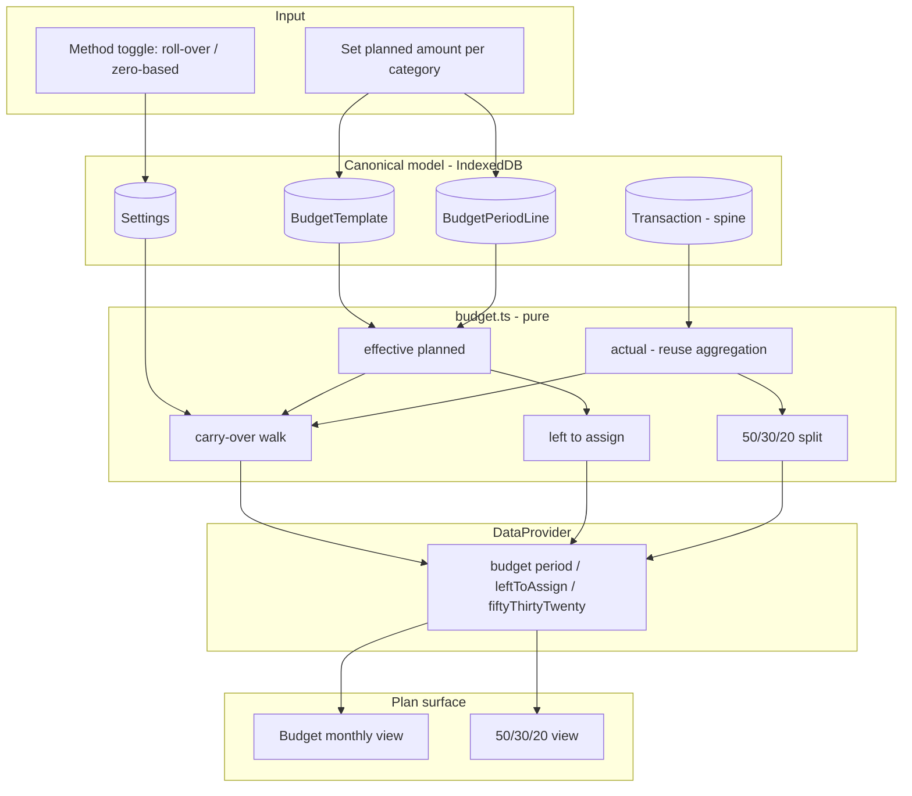
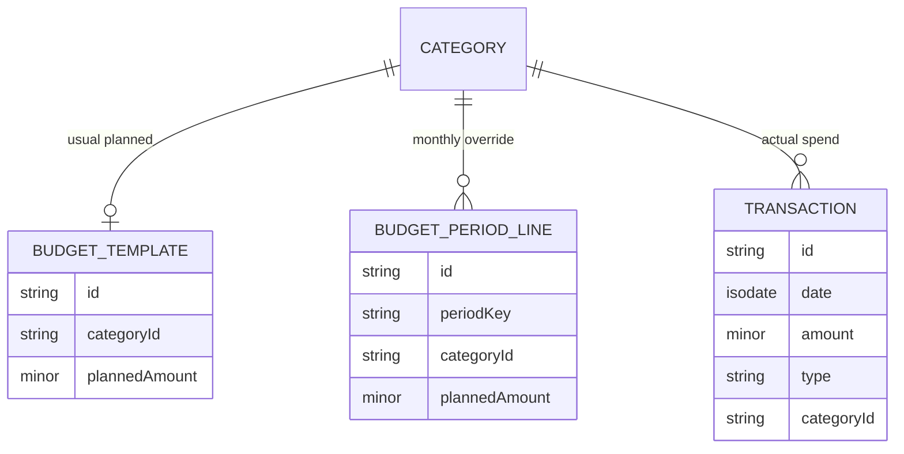
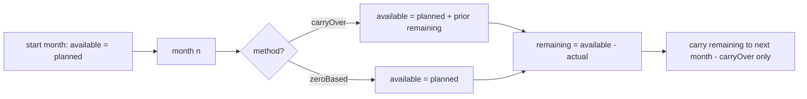
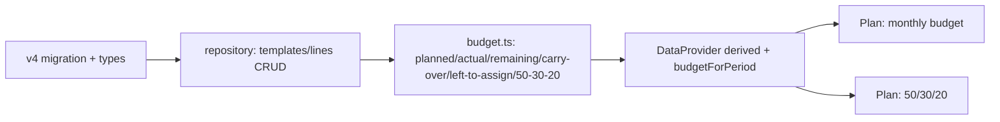

# Phase 3 — Architecture & Implementation Blueprint

**ALL-IN-ONE PERSONAL FINANCE by PremierWork**
Authoritative reference for Phase 3 (Budgeting). Implementation-ready.
As of 2026-09-18. Status: **DRAFT FOR FOUNDER APPROVAL — do not code until this is signed off.**

Derived, in priority order, from: (1) the existing repository at commit `732b14d` (Phase 0–2
complete: transactions spine, recurring/cash-flow, `SCHEMA_VERSION = 3`), (2) the Final Product
Blueprint, (3) the Phase 0/1 Build Spec and Phase 2 Architecture, (4) the verified 28-workflow
research (carry-over, zero-based, 50/30/20, paycheck), (5) the visual/theme reference. It extends,
not restates, those documents.

---

## 1. Executive summary

Phase 3 adds **budgeting**: planning what you intend to spend per category per month, and comparing
it to what you actually spent — with the two budgeting philosophies the research surfaced (carry-over
and zero-based) and the 50/30/20 lens. It is the lightest phase so far because the hard groundwork
already exists: the **transaction spine** provides "actual," the **period model** (`lib/period.ts`)
provides months, the **recurring occurrences** (Phase 2) provide known future commitments, and every
`Category` already carries a `needsWantsSavings` tag and the app already stores a `budgetMethod`.

Phase 3 introduces exactly one new idea — a **planned amount per category** — stored as a light
template plus per-month exceptions, mirroring the Phase 2 rule+override pattern. Everything a budget
screen shows (actual, remaining, carry-in, variance, "left to assign", the 50/30/20 split) is
**derived** at read time by a pure budget engine. No spending totals are stored; "actual" is always
the existing aggregation over transactions, so the budget can never disagree with the ledger.

The core principle, inherited: **planned is intent; actual is the transactions.** A budget never
moves money and never becomes a transaction. It only sets a target the engine compares reality
against.

Phase 3 fills the **Plan** surface (currently a "coming soon" placeholder) and touches no Phase 0–2
behavior. The only schema change is additive (v3 → v4).

**Scope decision up front (see §20, FD-3.1):** Phase 3 delivers **monthly** budgeting. The
**paycheck planner** introduces a second, conflicting period model (pay cycles vs calendar months)
that the research itself flagged as unresolved; it is therefore split into **Phase 3b** behind a
founder decision, not silently built alongside monthly.

---

## 2. Phase 3 scope

Phase 3 (3a) contains:

1. **Planned amounts** — a per-category monthly budget: a reusable default ("the usual") plus
   optional per-month overrides.
2. **Budget engine** — pure logic computing, per category per month: planned, actual (from
   transactions), remaining, variance, and carry-in.
3. **Carry-over vs zero-based** — the `budgetMethod` toggle, applied per the verified rule
   (reset at the budget year's start month; carry-over rolls the prior month's remaining forward;
   zero-based does not).
4. **Zero-based helper** — "left to assign" = expected income − planned allocations, so every unit
   of income can be given a job.
5. **50/30/20 lens** — classify categories by their `needsWantsSavings` tag and compare the split to
   the 50/30/20 target.
6. **Plan surface UI** — a monthly budget view (planned vs spent per category, remaining, carry-in)
   and a 50/30/20 view, in buyer language.

Explicitly reused (not rebuilt): the month period model, transaction aggregation for "actual", the
`budgetMethod` and period-start settings, the `needsWantsSavings` category tag, and the DataProvider
derived-state seam.

---

## 3. What is explicitly OUT of scope

- **Paycheck planner** — deferred to **Phase 3b** (a second period model; see §20 FD-3.1).
- **Goals / sinking funds, debt payoff** — Phase 4.
- **Net worth, investments** — Phase 5.
- **Insights, spending patterns, no-spend challenge, reminders, annual reports** — Phase 6.
- **Multi-user, sync, multi-currency UI** — deferred product-wide.
- **Auto-budgeting / AI suggestions** — not now. (Phase 2 occurrences MAY seed a suggested planned
   amount, but only as a pre-fill the user confirms — never an automatic budget.)

Nothing in Phase 3 modifies Phase 0–2 behavior. The only schema change is additive (§7).

---

## 4. Research findings (budgeting, from the 28 workflows)

Relevant tabs: the twelve **monthly tabs (JAN…DEC)**, **PAYCHECK**, **503020 (50/30/20)**, **SETUP**
(the zero-based vs carry-over toggle and the income/category setup). The standalone planners
(SINKING FUNDS, DEBT, NET WORTH, INVESTMENT, CHALLENGE) are **not** Phase 3.

Verified findings:

- **Budget vs Real per category.** Each monthly tab holds, per category: a **planned** ("budget")
  amount the user enters, and a **real** amount that is a SUMIF of actual transactions in that
  category for that month. Variance is planned − real. → In software: planned is stored; **actual is
  the existing transaction aggregation**; variance/remaining are derived.
- **Carry-over vs zero-based toggle (SETUP `D40`).** A single global setting switches the whole
  model. Verified from the cross-month formula `FEB!D23` / `FEB!L23`:
  `= IF(thisMonth = periodStartMonth, base, IF(method = carryOver, base + priorMonth_sameCell, base))`.
  Three things are verified: (a) at the **budget year's start month**, there is **no carry-in**
  (base only); (b) under **carry-over**, this month adds the prior month's running value; (c) under
  **zero-based**, there is no carry (base only). *The exact definition of `base` (whether the sheet's
  running cell nets spending) should be confirmed by a short cell trace during implementation if
  bit-exact spreadsheet parity is wanted; the product rule below is well-defined regardless — the
  spreadsheet is evidence, not the spec.*
- **Zero-based budgeting.** "Every unit of income is assigned to a category, so planned income −
  planned allocations = 0." → In software: a "left to assign" figure = expected income − Σ planned.
- **50/30/20 (503020 tab).** Categories are classified into needs / wants / savings and each is
  expressed as a share of income, compared to the 50 / 30 / 20 target. → The `Category.needsWantsSavings`
  tag (already stored) is exactly this classification.
- **PAYCHECK.** Budgeting per pay period (weekly / bi-weekly / semi-monthly) rather than per calendar
  month. This is a **different period model** and conflicts with monthly budgeting for a user paid on
  a cycle — the Research Bible flagged "which governs?" as an open question. → **Phase 3b + founder
  decision** (§20 FD-3.1), not built in 3a.

Presentation-only (do NOT port): the twelve duplicated month tabs (one parameterized month view
replaces them), the pre-provisioned budget rows, and the nested-IF month routing.

---

## 5. Consolidated workflow model

The monthly tabs, 503020, and the SETUP toggle are **one workflow seen three ways**:
*set a planned amount per category → compare to actual (from the ledger) → optionally roll leftover
forward, or force allocations to zero, and view the needs/wants/savings split.*

Consolidated: **one planned-amount store (template + monthly overrides) + one pure budget engine →
the Plan surface (monthly view + 50/30/20 view).** Actual always comes from the transaction
aggregation that already exists, so the budget and the ledger are the same truth, never two.

---

## 6. Domain architecture

**New entities**

- **BudgetTemplate** — the reusable default planned amount for a category (the "usual monthly
  budget"). One optional record per category. Editing it changes the default for every month that
  has no explicit override.
- **BudgetPeriodLine** — a per-(month, category) override of the planned amount for one specific
  month ("this September, groceries is Rs 20,000 not the usual 15,000"). Stores only deviations —
  the same exception pattern as Phase 2's RecurringOverride, so months are not pre-provisioned.

**Reused, unchanged**

- **Category** (`bucket`, `needsWantsSavings`) — the classification the budget and 50/30/20 read.
- **Transaction** — the sole source of "actual"; unchanged.
- **Settings** (`budgetMethod`, `periodStartMonth`, `periodStartYear`) — already present; drive
  carry-over vs zero-based and the year-start reset.
- **RecurringRule / occurrences** (Phase 2) — optional: a category's known upcoming recurring
  commitments can *suggest* a planned amount (a pre-fill the user confirms).

**Lifecycle & ownership**

```
BudgetTemplate (per category, the usual)  ──┐
                                            ├─▶ effective planned(month, category) = override ?? template
BudgetPeriodLine (per month+category)     ──┘
                                              │
Transactions ──▶ aggregation ──▶ actual(month, category)
                                              │
                        Budget engine ── planned, actual, remaining, carry-in, variance,
                                          left-to-assign, 50/30/20 split (all derived)
```

Dependencies: budget engine → BudgetTemplate + BudgetPeriodLine + transactions (via aggregation) +
Settings + period model. Nothing in Phase 3 is depended on by Phase 0–2 — it is a strict superset.

---

## 7. Data model

Money is integer minor units (`Minor`); dates are day-precision ISO. Period keys are `"YYYY-MM"`.
New records carry `BaseRecord` (`id`, `createdAt`, `updatedAt`).

### 7.1 New: `BudgetTemplate`

```ts
export interface BudgetTemplate extends BaseRecord {
  categoryId: string;      // FK → Category.id (unique: one template per category)
  plannedAmount: Minor;    // the usual monthly planned amount, >= 0
}
```

Uniqueness: at most one template per `categoryId` (enforced in the repository).

### 7.2 New: `BudgetPeriodLine` (per-month override)

```ts
export interface BudgetPeriodLine extends BaseRecord {
  periodKey: string;       // "YYYY-MM"
  categoryId: string;      // FK → Category.id
  plannedAmount: Minor;    // overrides the template for THIS month, >= 0
}
```

Uniqueness: at most one line per `(periodKey, categoryId)` (compound index `[periodKey+categoryId]`).

### 7.3 Optional: expected income for zero-based (see §20 FD-3.2)

Zero-based needs an "expected income" to assign against. Default (recommended): expected income for a
month = the sum of that month's **income-type** effective planned lines (income categories are
budgetable too), falling back to `IncomeSource.defaultAmount`. No new field required for the default.
If the founder prefers a single explicit "expected income this month" number, add it as a
`BudgetPeriodLine` with a reserved category, or a `Settings.expectedMonthlyIncome` — decided in FD-3.2.

### 7.4 Migration (`src/data/db.ts`): v3 → v4

Bump `SCHEMA_VERSION` from `3` to `4`. Add a `this.version(4)` block, additive and non-destructive:

- Add tables:
  - `budgetTemplates: "id, categoryId"`
  - `budgetPeriodLines: "id, periodKey, categoryId, [periodKey+categoryId]"`
- `.upgrade()`: set `settings.schemaVersion = 4`. No existing rows change (there is nothing to
  backfill — budgets simply don't exist until the user sets them).

`backup.ts` (`BackupFile.data`) adds `budgetTemplates` and `budgetPeriodLines` arrays; older backups
lacking them import cleanly.

---

## 8. Calculation architecture

All Phase 3 calculations are **pure** functions in `src/domain/budget.ts`, following the Phase 1/2
pattern. Format: **Input → Logic → Output → Consumer.**

### 8.1 Effective planned — `effectivePlanned(templates, lines, categoryId, periodKey)`
- Logic: the `BudgetPeriodLine` for `(periodKey, categoryId)` if one exists, else the
  `BudgetTemplate` for the category, else 0.
- Output: `Minor`. Consumer: everything below.

### 8.2 Actual — reuse Phase 1 aggregation
- Logic: `sumTransactions(transactions, { type: "expense", categoryId, range: monthRange(period) })`.
  This counts ALL real spend in the category that month — manual and recurring-paid alike — so
  budget "actual" equals the ledger. Income categories use `type: "income"`.
- Output: `Minor`. Consumer: remaining, variance, 50/30/20.

### 8.3 Remaining & variance
- `variance = effectivePlanned − actual` (positive = under budget).
- Under **zero-based**: `remaining(period, cat) = effectivePlanned − actual`.
- Under **carry-over**: `remaining(period, cat) = available(period, cat) − actual`, where `available`
  includes carry-in (8.4).

### 8.4 Carry-over (VERIFIED rule — the load-bearing one)
Per category, walking months forward from the budget year's start month
(`Settings.periodStartMonth/Year`):
- **At the start month:** `available = effectivePlanned` (NO carry-in — verified).
- **Otherwise, method = carryOver:** `available(period) = effectivePlanned(period) + remaining(priorPeriod)`,
  where `remaining(priorPeriod) = available(priorPeriod) − actual(priorPeriod)`. Leftover rolls
  forward; an overspent month carries a **negative** remaining forward (a deficit) — see §20 FD-3.3.
- **Otherwise, method = zeroBased:** `available(period) = effectivePlanned(period)` (no carry).
- Output per (period, category): `{ planned, carryIn, available, actual, remaining }`.
- Consumer: the monthly budget view.

### 8.5 Zero-based "left to assign"
- `leftToAssign(period) = expectedIncome(period) − Σ effectivePlanned(period, expense/savings cats)`.
- 0 = every unit assigned; positive = unassigned income; negative = over-allocated.
- Consumer: the monthly budget view (shown only when method = zeroBased).

### 8.6 50/30/20 split
- Group categories by `needsWantsSavings`; sum actual (and optionally planned) per group for the
  period; each group as a share of income; compare to 50 / 30 / 20.
- `none`-tagged categories are shown as "unclassified" (do not silently force them into a bucket).
- Consumer: the 50/30/20 view.

### 8.7 Historical vs planned
- **Actual** = transactions (already in the ledger). Never recomputed by Phase 3.
- **Planned / carry-in / remaining / left-to-assign** = computed, never stored.
- Rule: the budget engine reads planned amounts + the ledger and returns comparisons; it stores
  nothing derived and moves no money.

---

## 9. Integration with the spine & Phase 2

- **Actual comes only from transactions.** A budget line is a target; it is never a transaction and
  never affects a balance. This keeps the single-source-of-truth guarantee.
- **Recurring commitments (Phase 2) inform, never dictate.** When setting a category's planned
  amount, the UI may suggest a figure from that category's known monthly recurring occurrences (a
  pre-fill the user accepts or edits). The budget does not auto-change when a bill is paid — paying a
  bill is already a transaction, which shows up as "actual" through aggregation.
- **No second period model in 3a.** Monthly budgeting uses the existing `monthRange`. Paycheck
  budgeting (3b) is the only thing that would add a second period model, and it is deferred.

---

## 10. Data / state flow

```
User sets/edits a planned amount ─▶ repository (budgetTemplates / budgetPeriodLines) ─▶ IndexedDB
                                                                                          │
                                                    useLiveQuery re-fires ────────────────┘
                                                                                          │
                                        DataProvider derived adds: budget(period),        ▼
                                        leftToAssign(period), fiftyThirtyTwenty(period)
                                        (pure budget engine over templates+lines+txns+settings)
                                                                                          │
                                                    Plan screens read derived ────────────┘
                                                    (no engine calls / money math inline)
```

Concretely: add live queries `repo.listBudgetTemplates()` / `repo.listBudgetPeriodLines()`; add
memoized derived fields keyed by the currently-viewed month; screens consume them like
`derived.total`. A month-parameterized helper (`budgetForPeriod(periodKey)`) is exposed the same way
Phase 2 exposed `occurrencesForRange`, so navigating months does no inline computation in the screen.

---

## 11. UI architecture

Phase 3 fills the **Plan** tab (currently `ComingSoon`). No new top-level navigation.

- **Plan → Budget (monthly).**
  - A month selector.
  - Per category: the **Planned** amount (editable inline), **Spent** (derived actual), and **Left**
    (remaining). Under carry-over, show the **carried-in** amount ("+ Rs X from last month").
  - A top summary: total planned, total spent, total left.
  - Under **zero-based**: a prominent **"Left to assign"** figure with a plain hint.
  - Empty state: warm, offering to set budgets or copy last month's.
- **Plan → 50/30/20.**
  - Three groups (Needs / Wants / Savings) with each group's spend, its share, and the 50/30/20
    target; unclassified categories listed separately with a nudge to tag them.
- **Setup (optional new step).** An optional "Set your monthly budget" step reusing the budget
  editor; skippable. Also expose the carry-over vs zero-based choice in plain words in Setup/Settings.

Buyer language (enforced; extend `scripts/check-buyer-language.mjs`):
- "Planned", "Spent", "Left", "Left to assign", "Needs / Wants / Savings", "carried in from last
  month".
- The method toggle is shown as **"Roll leftover into next month"** (carry-over) vs **"Give every
  rupee a job"** (zero-based) — never the internal words `carryOver` / `zeroBased`.
- Never show: budget engine, template, period line, aggregation, selector, variance (use "Left" /
  "Over").

---

## 12. Architecture diagrams

### 12.1 Overall


### 12.2 Data model


### 12.3 Carry-over walk (per category)


### 12.4 Budget dependency flow (build order)


---

## 13. Research → product mapping

| Research workflow (tabs) | Underlying problem | Reusable system concept | Phase 3 relevance | Final product location |
|---|---|---|---|---|
| Monthly tabs (JAN–DEC) budget-vs-real | "Plan vs actual per category, per month" | Planned store + actual aggregation | Core | Plan → Budget; `BudgetTemplate` + `BudgetPeriodLine` + `budget.ts` |
| SETUP carry-over/zero-based toggle | "Two budgeting philosophies" | budgetMethod + carry-over walk | Core | Settings toggle; `budget.ts` §8.4/8.5 |
| 503020 | "Is my split balanced (needs/wants/savings)?" | needsWantsSavings classification | Core | Plan → 50/30/20 |
| Twelve duplicated month tabs | spreadsheet limitation | one parameterized month view | Consolidated | Plan → Budget month selector |
| PAYCHECK | "Budget per pay period" | pay-cycle period model | **Phase 3b (deferred)** | founder decision FD-3.1 |
| Recurring (Phase 2) | "Known upcoming commitments" | occurrences as budget suggestions | Optional pre-fill | Plan → Budget suggestions |

Consolidation made explicit: **monthly tabs + 503020 + SETUP toggle = one budgeting workflow**, built
once as a store + engine + two views. They are not three features.

---

## 14. Load-bearing calculations

1. **Carry-over walk (`budget.ts` §8.4).** Source: verified `FEB!D23`/`L23` (reset at year start;
   carry prior remaining; zero-based no carry). Expected: correct available/remaining per month;
   deficits carry forward under carry-over. Edge cases: the year-start month (no carry-in), a
   mid-year overspend (negative carry), a category added mid-year, switching method mid-year. Test:
   multi-month golden fixtures for both methods. Inaccuracy risk: wrong carry → a budget that looks
   flush when it isn't (or vice-versa).
2. **Actual via aggregation (§8.2).** Reuses the already-tested `sumTransactions`. Expected: budget
   "spent" equals the ledger exactly. Test: a fixture where a category's spent equals the sum of its
   transactions (manual + recurring-paid). Inaccuracy risk: filtering wrong (e.g. counting transfers)
   → spent disagrees with the ledger.
3. **Left to assign (§8.5, zero-based).** Expected: `expectedIncome − Σ planned`; 0 when fully
   assigned. Edge cases: income basis (FD-3.2), over-allocation (negative). Test: golden cases.
4. **50/30/20 split (§8.6).** Expected: correct grouping by tag and shares of income; `none` shown
   separately. Test: a fixture across all three tags plus an unclassified category.

---

## 15. Edge cases

- **Year-start month:** no carry-in, even under carry-over (verified). Test explicitly.
- **Overspend under carry-over:** the negative remaining carries forward as a deficit (recommended,
  truthful — FD-3.3). Confirm.
- **No budget set for a category:** effective planned = 0; the category still shows its actual spend
  (so unbudgeted spending is visible, not hidden).
- **Category archived mid-year:** past months keep their planned/actual; the category drops out of
  the editor for future months but historical budget rows stay valid.
- **Method switched mid-year:** the walk uses the current method from the start-month forward; document
  that switching re-derives (it does not rewrite stored planned amounts).
- **Income vs expense categories:** budgeting applies to expense/savings categories; income
  categories feed "expected income" for zero-based (FD-3.2). Do not let an income category count as a
  spend allocation.
- **Transfers & recurring-paid:** transfers are excluded from actual (as in Phase 1/2); a recurring
  bill paid is an ordinary transaction and counts as actual once (no double count — already
  guaranteed by the spine).
- **Month with no data:** planned from template, actual 0, remaining = available; renders cleanly.
- **Timezone/dates:** day-precision ISO + period keys, no drift (consistent with Phase 1/2).

---

## 16. Testing strategy

New `tests/budget.test.ts` plus repository/migration coverage, mirroring the existing layout.

- **`budget.test.ts`** — effective-planned resolution (override vs template vs 0); actual equals the
  ledger; the carry-over walk over several months for BOTH methods incl. year-start reset and a
  deficit carry; left-to-assign (0 / positive / negative); 50/30/20 grouping incl. `none`.
- **Repository tests** — template uniqueness (one per category); period-line uniqueness
  `(periodKey, categoryId)`; archived-category handling.
- **`data-layer.test.ts` (extend)** — v3 → v4 additive/non-destructive migration; new tables persist
  and round-trip; export/import includes templates + period lines.
- **Buyer-language check** — extend the scan to the Plan screens; CI-style fail on any banned term.
- **Regression** — all Phase 0–2 tests remain green (currently 84); new golden budget numbers are
  locked so a refactor can never silently change a budget figure.

Definition of "safe to merge": full suite green, typecheck clean, buyer-language clean, v3→v4
migration proven non-destructive on a v3 fixture.

---

## 17. Implementation sequence

Dependency-ordered; each step leaves the app working and shippable. No code until this is approved.

**Step 1 — Schema & types.** `BudgetTemplate`, `BudgetPeriodLine` in `types.ts`; v3→v4 additive
migration in `db.ts`; backup arrays. Done when: all 84 tests pass; a v3 DB upgrades to v4 with data
intact; export/import includes the new tables.

**Step 2 — Repository methods.** CRUD for templates and period lines; uniqueness (one template per
category, one line per period+category); archived handling. Done when: templates/lines persist;
uniqueness enforced; repository tests pass.

**Step 3 — Budget engine (`budget.ts`).** effectivePlanned, actual (via aggregation), remaining,
the carry-over walk, left-to-assign, 50/30/20. Done when: the golden budget tests (both methods,
year-start reset, deficit carry, left-to-assign, 50/30/20) pass. **Gate: confirm the carry-over
`base` semantics against the source cells if bit-exact parity is desired (§4).**

**Step 4 — DataProvider derived state.** Live queries + memoized `budgetForPeriod(periodKey)`,
`leftToAssign`, `fiftyThirtyTwenty`, exposed like Phase 2's helpers. Done when: screens can read
them; existing derived fields unchanged.

**Step 5 — Plan → Budget (monthly view).** Month selector; planned (editable) / spent / left per
category; carry-in under carry-over; totals; left-to-assign under zero-based. Buyer language. Done
when: a user sets budgets and sees spent/left update live from real transactions; carry-in correct.

**Step 6 — Plan → 50/30/20 view.** Needs/wants/savings split vs target; unclassified listed. Done
when: the split matches a hand-computed fixture and tagging nudges work.

**Step 7 — Setup step + method toggle + polish + verification.** Optional "set your monthly budget"
setup step; the roll-over/zero-based choice in plain words; responsive/theme/a11y pass; extend the
buyer-language scan; run the full §18 acceptance list. Done when: all acceptance criteria pass.

Steps 1–4 are invisible (data/engine); 5–7 are the visible Plan surface. Shippable after any step.

---

## 18. Acceptance criteria

1. A user sets a planned amount for a category and sees it as the month's budget; editing it updates
   live.
2. "Spent" for a category equals the sum of that category's transactions that month (manual +
   recurring-paid), matching the ledger exactly.
3. "Left" = planned − spent (zero-based) or available − spent (carry-over), correct including a
   category with no budget (planned 0, spend still visible).
4. Under carry-over: the year-start month has no carry-in; a later month adds the prior month's
   remaining; an overspent month carries a deficit forward — all verified by golden tests.
5. Under zero-based: "Left to assign" = expected income − planned allocations, reaching 0 when fully
   assigned; negative when over-allocated.
6. The 50/30/20 view shows correct needs/wants/savings shares vs the target, with unclassified
   categories listed separately.
7. Switching the method re-derives correctly without rewriting stored planned amounts.
8. v3 → v4 migration is additive and non-destructive; export/import round-trips including budgets.
9. All Phase 0–2 tests still pass; new budget golden tests pass; typecheck clean.
10. No customer-facing screen shows a banned internal term (automated check).
11. Every Plan screen works on phone and desktop, in both themes.
12. No budget value is ever stored as "actual" — spent is always derived from transactions (no second
    source of truth).

---

## 19. Risks

| Risk | Impact | Mitigation |
|---|---|---|
| Carry-over `base` semantics differ from the sheet | Budget numbers off under carry-over | Product rule defined here; optional cell-trace gate in Step 3 for bit-parity; golden tests lock it |
| Budget "spent" diverges from the ledger | Two sources of truth (the core defect we avoid) | Actual is ALWAYS `sumTransactions`; never stored; asserted in tests |
| Paycheck vs monthly conflict pulled in early | Scope blow-up + the unresolved period conflict | Paycheck deferred to 3b behind FD-3.1 |
| Zero-based income basis undefined | "Left to assign" wrong/ambiguous | FD-3.2 with a stated default (planned income lines) |
| Month-tab duplication copied literally | 12 pages instead of 1 | One parameterized month view (consolidated) |
| Overspend carry sign confusion | Deficit hidden or double-applied | FD-3.3 default (carry negative); explicit test |
| UI has no automated regression net (no React test lib) | A screen could break silently | Note as a known gap; consider adding a light Playwright smoke before Plan grows |

---

## 20. Founder decisions required

Each has a stated default so implementation is not blocked, but confirm before Step 3/5.

- **FD-3.1 — Paycheck planner.** Defer to Phase 3b (default) vs build alongside monthly now. If built,
  which period governs for a cycle-paid user — month or paycheck? Default: **defer to 3b; monthly is
  primary.**
- **FD-3.2 — Expected income basis for zero-based.** Sum of income-type planned lines (default) vs
  actual income received vs a single explicit "expected income this month" number. Default: **planned
  income lines**, falling back to `IncomeSource.defaultAmount`.
- **FD-3.3 — Does carry-over carry an overspend (negative remaining) forward?** Default: **yes**
  (truthful; a deficit reduces next month's available), matching the verified running-balance shape.
- **FD-3.4 — Do savings/debt categories participate in the budget and in "left to assign"?** Default:
  **yes** — savings is a planned allocation (zero-based assigns to savings too); the 50/30/20 view
  needs the savings bucket.
- **FD-3.5 — Seeding a new month.** From the template only (default) vs copy the prior month's lines.
  Default: **template only**; offer a one-tap "copy last month" action in the UI.

None of these change the architecture; they parameterize `budget.ts` and one optional Settings field.

---

## 21. Future-phase compatibility

- **Phase 4 (Goals & Debt).** A sinking-fund goal is a planned monthly contribution to a savings
  category — it reuses the same planned-amount + carry-over machinery, and a contribution is an
  ordinary transaction (actual). Debt payments likewise. No Phase 3 rework.
- **Phase 5 (Wealth).** Net worth and investments read balances/transactions; budgeting is orthogonal
  and does not block them.
- **Phase 6 (Intelligence).** Budget-vs-actual, overspend, and the 50/30/20 split are exactly the
  signals an insights/alerts layer consumes; they are computed here and ready to be surfaced later.
- **Paycheck (3b).** When built, it adds a pay-cycle period model; the budget engine is already
  period-agnostic in shape (it takes a period key + a date range), so 3b supplies a different period
  provider rather than a new engine.

The invariant that keeps all this safe: **planned is intent, actual is transactions; the budget
stores only targets and computes every comparison, so it can never disagree with the ledger.**

---

*End of Phase 3 Architecture & Implementation Blueprint. Implementation begins only after founder
approval and the FD-3.x decisions; the recommended first step is §17 Step 1 (schema & types + v3→v4
migration).*
