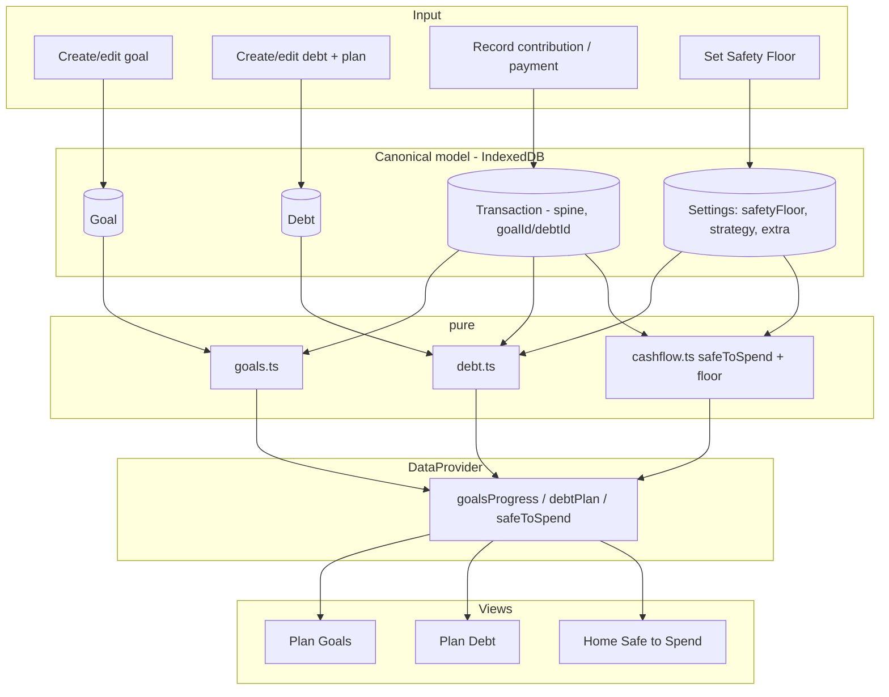
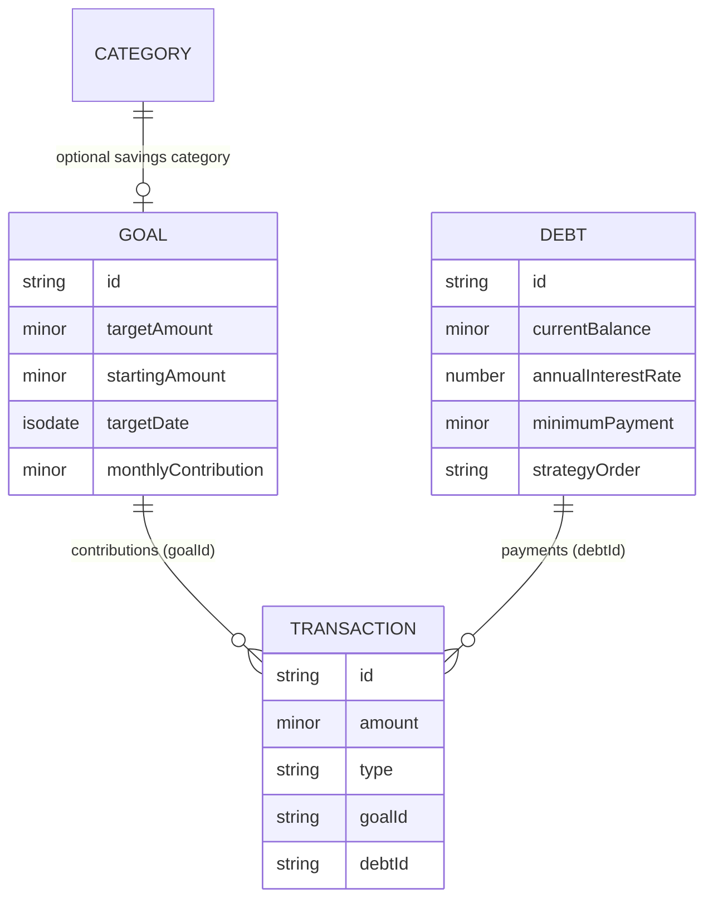
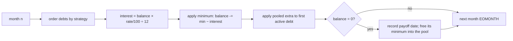
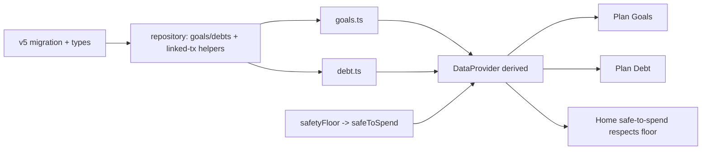

# Phase 4 — Architecture & Implementation Blueprint

**ALL-IN-ONE PERSONAL FINANCE by PremierWork (CashHorizon)**
Authoritative reference for Phase 4 (Goals, Debt & Safety Floor). Implementation-ready.
As of 2026-09-18. Status: **DRAFT FOR FOUNDER APPROVAL — do not code until this is signed off.**

Derived, in priority order, from: (1) the existing repository at `2b72657` (Phase 0–3 complete:
transactions spine, recurring/cash-flow, budgeting; `SCHEMA_VERSION = 4`; `Transaction` already
carries `goalId`/`debtId`/`investmentId` links; `Category` has `savings` and `debt` buckets),
(2) the Final Product Blueprint, (3) the verified 28-workflow research (SINKING FUNDS, DEBT
CALCULATOR), (4) the CashHorizon product/marketing (which already promises "debt payoff tracking"
and "emergency cushion protection"), (5) the visual/theme reference. It extends, not restates, those.

---

## 1. Executive summary

Phase 4 adds the two "get ahead" tools the product already advertises but does not yet deliver:
**savings goals** (sinking funds), **debt payoff**, and the **Safety Floor** (emergency cushion).
Building it makes the CashHorizon instruction guide honest.

The groundwork is already in place: `Transaction` carries `goalId`, `debtId` and `investmentId`
links (reserved in Phase 1/2), so **a goal contribution or a debt payment is just a transaction with
its link set — no second ledger.** Two small stored entities are added (a Goal and a Debt) plus one
Settings field (the Safety Floor). Everything a screen shows — a goal's progress, a debt's payoff
date, total interest, the months-left — is **derived** by pure engines from the goal/debt records and
the linked transactions. Projections (the amortization schedule, the projected finish date) are
computed on demand, never stored, exactly like the cash-flow projection in Phase 2.

The two verified formulas from the source spreadsheets are restated here as the implementation spec:
the **sinking-fund math** (SINKING FUNDS tab) and the **debt amortization** (DEBT CALCULATOR:
`monthly interest = balance × annual-rate ÷ 12`, snowball/avalanche allocation of a monthly extra
payment over an EOMONTH timeline).

The **Safety Floor** is a minimum balance the user never wants to dip below; it plugs into the
existing Safe-to-Spend engine (Phase 2) as one extra subtraction, so "safe to spend" never eats the
cushion. This is a tiny, high-value change that directly fulfils the "emergency cushion protection"
promise.

Phase 4 fills the **Plan** surface (adding Goals and Debt beside Budget and 50/30/20) and adds one
Settings field; it touches no Phase 0–3 behavior except the one Safe-to-Spend line. The only schema
change is additive (v4 → v5).

---

## 2. Phase 4 scope

1. **Savings goals (sinking funds)** — a named target amount, optional target date and/or monthly
   contribution; progress derived from linked "set aside" transactions.
2. **Debt payoff** — named debts (balance, rate, minimum payment); a payoff plan (snowball /
   avalanche) computing debt-free date, months left and total interest from a monthly extra payment.
3. **Safety Floor** — a single minimum-balance setting that the Safe-to-Spend number reserves, so the
   emergency cushion is protected.
4. **Record a contribution / payment** — a transaction linked to the goal/debt via the existing
   `goalId`/`debtId`, created through the existing Quick Capture path.
5. **Plan surface UI** — Goals and Debt views added to the existing Plan tab; the Safety Floor exposed
   in Settings/Setup and reflected on Home's Safe to Spend.

Explicitly reused (not rebuilt): the `goalId`/`debtId` transaction links, the aggregation engine for
"how much has been set aside / paid", the period model, the Safe-to-Spend engine, and the DataProvider
derived-state seam.

---

## 3. What is explicitly OUT of scope

- **Net worth & investments** — Phase 5. (A debt's balance contributes to net worth later, but net
  worth is not built here.)
- **Dashboard insights, spending patterns, no-spend challenge, reminders, annual reports** — Phase 6.
- **Paycheck planner** — still Phase 3b (deferred).
- **Multi-user, sync, multi-currency UI** — deferred product-wide.
- **Auto-posting debt payments / auto-contributions** — default is manual confirmation, matching FD-3
  in Phase 2. A recurring contribution/payment (a RecurringRule linked to a goal/debt) is a natural
  extension but is only wired if FD-4.6 opts in.
- **Credit-score, payoff "what-if" sliders beyond the core plan** — later polish, not core Phase 4.

Nothing in Phase 4 modifies Phase 0–3 behavior except adding the Safety-Floor subtraction to the
Safe-to-Spend engine. The only schema change is additive (§7).

---

## 4. Research findings (Goals & Debt, verified)

Relevant tabs: **SINKING FUNDS** and **DEBT CALCULATOR** (both standalone planners in the source
workbook; the Research Bible flagged that they should connect to the transaction spine rather than
stay isolated — Phase 4 does exactly that).

**Sinking funds (verified, SINKING FUNDS tab):**
- Per goal: **Saved** = starting amount + Σ contributions; **Remaining** = goal − saved;
  **Progress %** = saved ÷ goal; **Monthly target** = remaining ÷ months left; **Projected target
  date** ≈ today + (months needed) (the sheet used `TODAY() + months × 30`). Global roll-ups sum all
  goals.
- Product translation: saved = Σ transactions linked to the goal (`goalId`); everything else derived.

**Debt payoff (verified, DEBT CALCULATOR tab):**
- Inputs per debt: **initial balance**, **annual interest rate**, **minimum payment**. Global: a
  **monthly extra payment** and a **strategy** (Snowball / Avalanche / Custom).
- Monthly step (verified `W140 = Y139 × Y13 ÷ 12`): **interest = outstanding balance × annual-rate ÷
  12**; the month's payment (minimum + any extra directed by strategy) reduces the balance by
  `(payment − interest)`; timeline steps by whole months (EOMONTH). Outputs: **debt-free date**,
  **months left**, **total interest**.
- Strategy: **Avalanche** directs the extra to the highest-rate debt first (least total interest);
  **Snowball** to the smallest-balance debt first (fastest first win); **Custom** = user order.
- Product translation: the amortization is a **forecast** computed on demand from the debt records +
  the plan; actual payments made are transactions (`debtId`), used for history and to keep the stored
  balance current (see §9 and FD-4.1).

Presentation-only (do NOT port): the 342-column pre-provisioned per-debt schedule grid and the
SPARKLINE bars — these are spreadsheet mechanics; the product computes the schedule and renders it
natively.

---

## 5. Consolidated workflow model

SINKING FUNDS and DEBT CALCULATOR are two instances of one shape: *set a target (save toward X / pay
off Y) → record real money toward it (a transaction) → see progress and a projected finish date.*

Consolidated: **two small stored entities (Goal, Debt) + two pure engines (goal, debt) + the existing
transaction links → Plan → Goals and Plan → Debt.** Progress and payoff are always derived from the
records + the linked transactions, so they can never disagree with the ledger. The Safety Floor is a
one-field setting that feeds the existing Safe-to-Spend engine.

---

## 6. Domain architecture

**New entities**

- **Goal** — a savings target. Owns its lifecycle (create, edit, complete, archive). Depends on
  nothing but its linked transactions. Optionally references a savings `Category`.
- **Debt** — a debt to pay off. Owns its lifecycle. Its payoff plan depends on the debt's balance +
  rate + minimum + the plan-level extra payment + strategy.

**Reused, unchanged**

- **Transaction** — the sole record of money moved; `goalId`/`debtId` links already exist. A
  contribution or payment is a transaction with the link set. Unchanged schema.
- **Category** (`savings`, `debt` buckets) — a goal may map to a savings category; a debt payment may
  use a debt category.
- **Settings** — gains one field: `safetyFloor` (Minor).
- **RecurringRule** — already carries `goalId`/`debtId` (reserved); a recurring contribution/payment
  is a rule with the link set (only wired if FD-4.6 opts in).
- **Safe-to-Spend engine** (Phase 2) — extended by one subtraction (the Safety Floor).

**Lifecycle & ownership**

```
Goal (target)  ──linked──▶ Transactions (goalId)  ──▶ goal engine: saved / remaining / progress / projected date
Debt (balance,rate,min) ──linked──▶ Transactions (debtId) ──▶ debt engine: schedule / debt-free date / total interest
Settings.safetyFloor ──▶ Safe-to-Spend engine (one extra subtraction)
```

Dependencies: goal engine → Goal + linked transactions; debt engine → Debts + plan (extra, strategy) +
linked transactions; Safe-to-Spend → + safetyFloor. Nothing in Phase 4 is depended on by Phase 0–3
(except the additive Safety-Floor line) — it is a strict superset.

---

## 7. Data model

Money = integer minor units (`Minor`); dates = day-precision ISO. New records carry `BaseRecord`.

### 7.1 New: `Goal`

```ts
export interface Goal extends BaseRecord {
  name: string;
  targetAmount: Minor;              // > 0
  startingAmount: Minor;            // already-saved at creation (default 0)
  targetDate: IsoDate | null;       // optional deadline
  monthlyContribution: Minor | null;// optional planned monthly set-aside
  categoryId: string | null;        // optional savings category
  archived: boolean;
  completedAt: number | null;       // epoch ms when target reached (derived-set)
}
```

### 7.2 New: `Debt`

```ts
export type DebtStrategy = "snowball" | "avalanche" | "custom";

export interface Debt extends BaseRecord {
  name: string;
  currentBalance: Minor;            // amount owed (truth anchor; see §9 / FD-4.1)
  annualInterestRate: number;       // annual %, e.g. 24 for 24%/yr (stored as a number)
  minimumPayment: Minor;            // required monthly minimum
  balanceAsOf: IsoDate;             // the date currentBalance was entered/updated
  customOrder: number | null;       // for "custom" strategy ordering
  archived: boolean;
  paidOffAt: number | null;         // epoch ms when balance reached 0 (derived-set)
}
```

Plan-level settings for the debt engine (Settings, §7.4): a monthly **extra payment** and the
**strategy**.

### 7.3 Additive fields on `Settings`

```ts
safetyFloor: Minor;                 // minimum balance to protect (default 0)
debtStrategy: DebtStrategy;         // default per FD-4.2
debtMonthlyExtra: Minor;            // extra beyond minimums, applied by strategy (default 0)
```

### 7.4 Migration (`src/data/db.ts`): v4 → v5

Bump `SCHEMA_VERSION` from `4` to `5`. Add a `this.version(5)` block, additive and non-destructive:

- Add tables:
  - `goals: "id, name, archived, categoryId"`
  - `debts: "id, name, archived"`
- `.upgrade()`: set `settings.safetyFloor = 0`, `settings.debtStrategy = "<FD-4.2 default>"`,
  `settings.debtMonthlyExtra = 0`, `settings.schemaVersion = 5`. Nothing else changes (the
  `goalId`/`debtId` transaction fields already exist).

`backup.ts` adds `goals` and `debts` arrays; older backups import cleanly.

---

## 8. Calculation architecture

Pure functions in `src/domain/goals.ts` and `src/domain/debt.ts`, following the Phase 1–3 pattern.
Format: **Input → Logic → Output → Consumer.**

### 8.1 Goal progress — `src/domain/goals.ts`
- **Input:** a Goal, its linked transactions, `today`.
- **Logic (verified, SINKING FUNDS):** saved = startingAmount + Σ(linked contribution transactions);
  remaining = max(0, targetAmount − saved); progress = saved ÷ targetAmount (clamped 0–1 for display,
  raw kept for over-funding); monthly target = remaining ÷ monthsUntil(targetDate) when a target date
  is set; projected finish = when monthlyContribution is set, today + ceil(remaining ÷
  monthlyContribution) months. Mark a goal complete when saved ≥ target.
- **Output:** `{ saved, remaining, progress, monthlyTarget?, projectedDate?, complete }` per goal,
  plus global totals across goals.
- **Consumer:** Plan → Goals; Home ("goal progress" when relevant).

### 8.2 Debt payoff — `src/domain/debt.ts` (load-bearing)
- **Input:** the debts (balance, rate, minimum), the plan (`debtMonthlyExtra`, `debtStrategy`),
  `today`.
- **Logic (verified, DEBT CALCULATOR):** simulate month by month from `today`:
  1. Order debts by strategy (avalanche = highest `annualInterestRate` first; snowball = smallest
     `currentBalance` first; custom = `customOrder`).
  2. Each month, for every active debt: `interest = round(balance × annualInterestRate/100 ÷ 12)`;
     apply its minimum payment; `balance −= (payment − interest)` (never below 0).
  3. Pool the `debtMonthlyExtra` (plus freed minimums from any debt already paid off — the "snowball"
     effect) and apply it to the FIRST active debt in the ordered list.
  4. Step to the next month (EOMONTH timeline) until all balances reach 0 or a safety cap (e.g. 600
     months) is hit.
- **Output per debt:** payoff month/date, months left, total interest paid. Overall: debt-free date,
  total interest across all debts, and a month-by-month schedule (for a chart), computed on demand.
- **Consumer:** Plan → Debt.
- **Edge/verify:** minimum payment ≤ monthly interest (debt never shrinks → flag "this debt won't be
  paid off at the current payment"); rate 0 (no interest); a debt already at 0; extremely long
  payoff (cap + warn). Golden tests against hand-computed schedules.

### 8.3 Safety Floor → Safe to Spend — extend `src/domain/cashflow.ts`
- **Change (one line):** `safeToSpend = clearedBalance − Σ(unpaid upcoming out-commitments within
  horizon) − settings.safetyFloor` (income pre-credit still off per FD-2). The Safety Floor is
  reserved so the cushion is never counted as spendable. May push Safe to Spend negative — shown
  honestly, as before.
- **Consumer:** Home hero (unchanged screen; the number now respects the cushion).

### 8.4 Actual vs forecast (the boundary)
- **Actual** = transactions (contributions, payments) — already in the ledger; drives saved-so-far and
  keeps the debt balance current.
- **Forecast** = the goal's projected finish date and the debt's amortization schedule — computed,
  never stored.
- Rule: a contribution/payment contributes to progress only as a real transaction; the projection is
  a plan over the current numbers, never a stored second truth.

---

## 9. Transaction integration

One ledger. Goals and debts never move money by themselves.

- **A contribution** (money set aside toward a goal) is a Transaction with `goalId` set, created
  through the existing Quick Capture path. Saved-so-far = Σ these. (FD-4.4: whether a contribution is
  a transfer into a savings account or a simple tagged "set aside" — default: a tagged transaction,
  no separate account required.)
- **A debt payment** is a Transaction with `debtId` set (money out), created through Quick Capture.
  Payment history = Σ these.
- **The debt's current balance** is the truth anchor the payoff forecast runs from. To avoid drift
  from the user's real statement, the default (FD-4.1) is: the user maintains `currentBalance` (updates
  it from a statement), and recording a payment logs the transaction and offers "update balance?".
  Optionally (FD-4.1 alt) recording a payment auto-decrements `currentBalance` by `(payment − this
  period's interest)`. Default: **user-maintained balance + logged payment**, so the app never claims
  a balance that silently diverges from reality.
- **No auto-posting** (matches Phase 2 FD-3): contributions/payments happen on the user's Save.
- Deleting a contribution/payment transaction returns the goal/debt progress accordingly — status is
  derived.

---

## 10. Data / state flow

```
User records a contribution/payment ─▶ Quick Capture ─▶ repository.createTransaction (goalId/debtId set)
User edits a Goal/Debt / Safety Floor ─▶ repository (goals/debts/settings) ─▶ IndexedDB
                                                                                   │
                                             useLiveQuery re-fires ────────────────┘
                                                                                   ▼
                        DataProvider derived adds: goalsProgress, debtPlan (schedule/debt-free date),
                        and safeToSpend now subtracts safetyFloor
                                                                                   │
                                             Plan / Home screens read derived ─────┘  (no engine calls inline)
```

Concretely: add live queries `listGoals` / `listDebts`; add derived `goalsProgress`, `debtPlan`
(computed via the engines with `todayIso()` and the plan settings); wire `settings.safetyFloor` into
the existing `safeToSpend` config. Screens read `derived.*`.

---

## 11. UI architecture

Phase 4 adds to the existing **Plan** surface (which now has Budget | 50/30/20). No new top-level nav.

- **Plan → Goals.** A list of goals, each a progress card: name, saved / target, a progress bar,
  remaining, and (if set) "on track for <date>" or "Rs X/month to hit <date>". A "Set aside" action
  (records a contribution via Quick Capture). Create/edit/complete/archive.
- **Plan → Debt.** A list of debts with balance, rate, minimum, and the plan summary: **debt-free
  date**, **total interest**, per-debt payoff order. A strategy toggle (Snowball / Avalanche) and a
  monthly-extra input (both in plain words). A "Record payment" action (via Quick Capture). Optionally
  a simple payoff timeline chart.
- **Settings / Setup.** A **Safety Floor** field ("Keep at least Rs ___ set aside") in Settings and an
  optional Setup step. Home's Safe to Spend automatically reflects it.
- **Home (optional, light).** When a goal is close or a debt milestone hits, a one-line "goal
  progress" / "debt progress" note may appear — kept minimal (progressive disclosure), only when
  relevant.

Buyer language (enforced; extend `scripts/check-buyer-language.mjs`):
- "Saved", "Target", "Remaining", "Set aside", "On track for…", "Debt-free date", "Interest you'll
  pay", "Pay off smallest first" (snowball) / "Pay off highest-rate first" (avalanche), "Keep a
  cushion of…".
- Never show: amortization, principal, engine, projection, strategy (internal), schedule (internal).

---

## 12. Architecture diagrams

### 12.1 Overall


### 12.2 Data model


### 12.3 Debt amortization (per month)


### 12.4 Build dependency flow


---

## 13. Research → product mapping

| Research workflow | Underlying problem | Reusable system concept | Phase 4 relevance | Final product location |
|---|---|---|---|---|
| SINKING FUNDS | "Save deliberately toward a target" | Goal + linked contributions | Core | Plan → Goals; `goals.ts` |
| DEBT CALCULATOR | "Pay off debt fastest / cheapest" | Debt + amortization forecast | Core (load-bearing) | Plan → Debt; `debt.ts` |
| (CashHorizon promise) "emergency cushion" | "Don't spend my safety buffer" | Safety Floor → Safe to Spend | Core | Settings + `cashflow.ts` |
| Recurring (Phase 2) | "Automatic monthly contribution/payment" | RecurringRule with goalId/debtId | Optional (FD-4.6) | recurring linked to a goal/debt |

Consolidation: SINKING FUNDS + DEBT CALCULATOR = one "target + real money toward it + forecast"
workflow, built as two small entities + two engines that both read the shared transaction links.

---

## 14. Load-bearing calculations

1. **Debt amortization (`debt.ts`).** Verified: interest = balance × annual-rate ÷ 12; balance −=
   (payment − interest); strategy-ordered extra; EOMONTH steps. Edge: min ≤ interest (never pays off →
   warn), rate 0, already-0, pooled freed minimums (snowball effect), payoff-cap. Golden tests vs
   hand-computed schedules (a single debt to payoff; two debts under each strategy). Inaccuracy risk:
   wrong interest period or extra-allocation → wrong debt-free date / total interest, the core promise.
2. **Goal progress (`goals.ts`).** Saved = Σ contributions; remaining/progress/monthly-target/projected
   date. Edge: over-funding (saved > target), no target date, zero monthly contribution. Test golden
   cases. Inaccuracy risk: miscount contributions → wrong progress.
3. **Safety Floor in Safe to Spend (`cashflow.ts`).** One subtraction; must not double-count and must
   allow negative. Test: floor reduces safe-to-spend by exactly the floor; floor 0 = unchanged.

---

## 15. Edge cases

- **Debt minimum too low to ever pay off** (min ≤ monthly interest): detect and show "won't be paid
  off at this payment — increase it" rather than looping forever (payoff cap).
- **Rate 0%**: no interest; balance − payment each month.
- **Over-funded goal** (saved > target): show complete + the surplus; don't show negative remaining.
- **Debt balance drift**: the stored `currentBalance` is user-maintained (FD-4.1); payments are logged
  but the app does not silently recompute the balance unless FD-4.1-alt is chosen.
- **Deleting a contribution/payment**: progress/history recompute (derived), no orphan state.
- **Safety Floor > balance**: Safe to Spend goes negative — shown honestly.
- **Category archived** that a goal/debt referenced: keep historical links valid; drop from pickers.
- **Strategy switch**: re-derives the plan; does not alter stored balances.
- **Timezone/dates**: day-precision ISO + injected `today`, no drift (consistent with all phases).

---

## 16. Testing strategy

New `tests/goals.test.ts`, `tests/debt.test.ts`, plus repository/migration coverage.

- **`debt.test.ts`** — single-debt payoff schedule vs hand-computed; two debts under snowball AND
  avalanche (different order, different total interest); min-too-low warning; rate 0; pooled freed
  minimums; payoff cap.
- **`goals.test.ts`** — saved/remaining/progress; monthly target with a target date; projected date
  with a monthly contribution; over-funding; completion.
- **`cashflow.test.ts` (extend)** — Safety Floor subtracts exactly; floor 0 unchanged; negative shown.
- **Repository tests** — goals/debts CRUD; a contribution/payment creates a linked transaction and
  feeds the engine; archived handling.
- **`data-layer.test.ts` (extend)** — v4 → v5 additive/non-destructive; goals/debts round-trip;
  export/import includes them.
- **Buyer-language** — extend the scan to the new Plan screens.
- **Regression** — all 104 existing tests stay green; new golden numbers locked.

---

## 17. Implementation sequence (~6 steps; split 1–3 / 4–6 across two chats)

**Step 1 — Schema & types + v4→v5 migration.** `Goal`, `Debt`, `DebtStrategy`; Settings +
`safetyFloor`/`debtStrategy`/`debtMonthlyExtra`; v5 migration; backup arrays. Done when: all 104 tests
pass; v4→v5 additive on a v4 fixture; export/import includes the new tables.

**Step 2 — Repository methods.** Goals CRUD; Debts CRUD; helpers to record a contribution/payment as a
linked transaction via the existing createTransaction; archived handling. Repository tests.

**Step 3 — Goal engine (`goals.ts`).** The verified sinking-fund math + golden tests.

**Step 4 — Debt engine (`debt.ts`, load-bearing).** The verified amortization + snowball/avalanche +
golden tests. **Gate: golden schedules must match hand-computed values before UI.**

**Step 5 — Derived state + Safety Floor.** DataProvider `goalsProgress`/`debtPlan`; wire
`settings.safetyFloor` into `safeToSpend` (one line) + its test. Existing derived unchanged.

**Step 6 — Plan → Goals + Plan → Debt UI + Safety Floor setting + polish + verification.** Buyer
language; responsive/theme/a11y; extend the buyer-language scan; run the §18 acceptance list.
*(If the Debt UI — schedule/chart — is heavy, split into 6a Goals UI and 6b Debt UI + polish, making
Phase 4 seven steps.)*

Each step: full gate suite green → its own commit → push → verify. Steps 1–5 invisible (data/engine),
6 visible.

---

## 18. Acceptance criteria

1. A user creates a goal and sees saved / target / remaining and a progress bar.
2. Recording a "set aside" creates one linked transaction; the goal's saved amount and progress update
   live; deleting it reverts them.
3. A goal with a target date shows a monthly target; a goal with a monthly contribution shows a
   projected finish date.
4. A user adds debts (balance, rate, minimum) and sees a **debt-free date**, **total interest**, and
   the payoff order, correct under BOTH snowball and avalanche (golden-tested).
5. Recording a debt payment creates one linked transaction and appears in history; the plan reflects it
   per FD-4.1.
6. A debt whose minimum can't cover its interest is flagged, not looped.
7. The **Safety Floor** reduces Safe to Spend by exactly the floor; Home reflects it; it may go
   negative honestly.
8. v4 → v5 migration is additive/non-destructive; export/import round-trips goals + debts.
9. All 104 existing tests pass; new goal/debt golden tests pass; typecheck clean.
10. No banned internal term reaches the UI (automated check).
11. Every new Plan screen works on phone + desktop, both themes.
12. Progress/payoff are always derived from records + transactions — no second source of truth.

---

## 19. Risks

| Risk | Impact | Mitigation |
|---|---|---|
| Debt amortization wrong (interest period, extra allocation) | Wrong debt-free date / interest — the core promise | Verified rule restated; golden schedules vs hand math; gate before UI |
| Debt balance drifts from the user's statement | App shows a wrong balance | FD-4.1 default: user-maintained balance + logged payments; no silent recompute |
| Marketing promises ahead of build | Bad reviews (the competitor trap) | Phase 4 delivers debt payoff + Safety Floor, closing the CashHorizon PDF gap |
| Min-payment infinite loop | Hang / nonsense output | Payoff cap + "won't pay off" warning |
| Second-source-of-truth creep | Divergence from ledger | Progress/payoff always derived from linked transactions |
| Safety Floor confusion (hard block vs soft) | UX frustration | FD-4.3 default: soft (reduces Safe to Spend), no hard block |
| UI overload on Plan | Competes with calm design | Progressive disclosure; Goals/Debt as their own Plan views |

---

## 20. Founder decisions required (defaults stated; confirm before Step 4/6)

- **FD-4.1 — Debt balance maintenance.** User-maintained `currentBalance` + logged payments (default)
  vs auto-decrement the balance by `(payment − interest)` on each recorded payment. Default:
  **user-maintained + logged**, with a "update balance?" prompt — avoids silent drift from the real
  statement.
- **FD-4.2 — Default debt strategy.** Snowball (smallest first, motivational) vs Avalanche
  (highest-rate first, least interest). Default: **offer both; default view = Avalanche** (saves the
  most money) — confirm, since some users prefer Snowball's quick wins.
- **FD-4.3 — Safety Floor behavior.** Soft (reduces Safe to Spend; default) vs hard (warns/blocks
  spending that would breach it). Default: **soft**.
- **FD-4.4 — Contribution mechanism.** A tagged "set aside" transaction (default; no separate account)
  vs a transfer into a designated savings account. Default: **tagged transaction**.
- **FD-4.5 — Debt as entity vs account.** Separate Debt entity (default) vs modeling a debt as a
  `loan`-type Account. Default: **separate Debt entity** (keeps amortization clean), optional link to
  an account later.
- **FD-4.6 — Recurring contributions/payments.** Wire a RecurringRule linked to a goal/debt now vs
  later. Default: **later** (manual for v1; the links already exist so it's a small future add).

None change the architecture; they parameterize `debt.ts`, `goals.ts`, and Settings.

---

## 21. Future-phase compatibility

- **Phase 5 (Wealth / net worth & investments).** A debt's `currentBalance` is a liability and a
  goal's saved amount / a savings account is an asset — net worth reads these plus account balances.
  Investments reuse the `investmentId` transaction link already present. No Phase 4 rework.
- **Phase 6 (Intelligence).** "You'll be debt-free by <date>", "goal on track / behind", "cushion
  intact" are ready-made signals the insights/reminders layer consumes; Phase 4 computes them.
- **Recurring automation.** Because `RecurringRule` already carries `goalId`/`debtId`, automatic
  monthly contributions/payments are a later opt-in (FD-4.6) with no schema change.

The invariant that keeps it safe: **a goal/debt stores only a target and its terms; progress and
payoff are computed from the linked transactions — so they can never disagree with the ledger, and no
projection is ever stored as truth.**

---

*End of Phase 4 Architecture & Implementation Blueprint. Implementation begins only after founder
approval and the FD-4.x decisions; the recommended first step is §17 Step 1 (schema & types + v4→v5
migration).*
